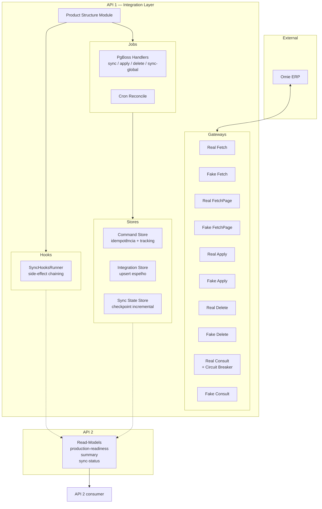
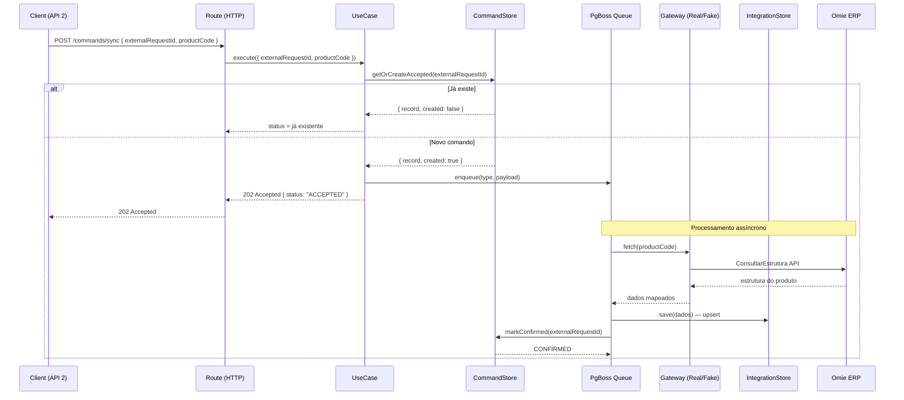
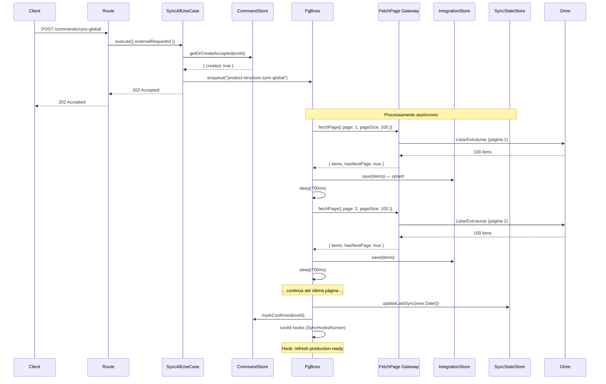
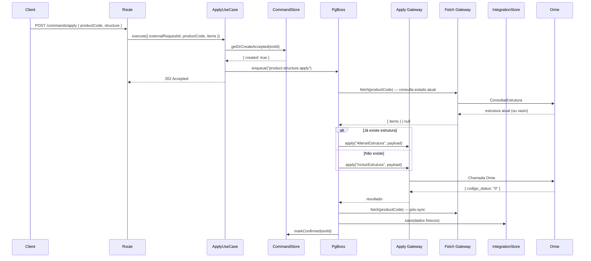
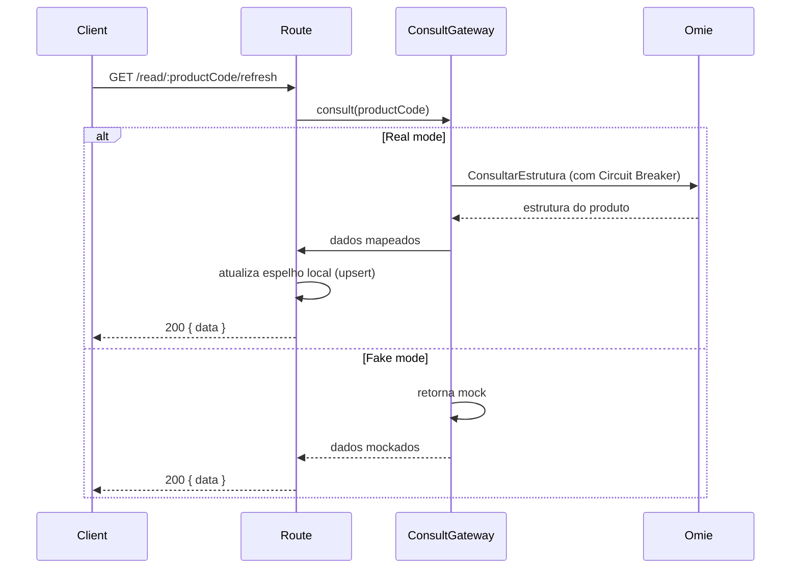

# 📦 Product Structure — Integration Module

> ⚡ **Módulo Canônico do Projeto** — Este é o módulo de integração mais completo e revisado.  
> Todos os novos módulos devem seguir sua estrutura, padrões e convenções.

**Documentação:** Rotas completas com curl ↓ | Arquitetura ↓ | Dev/Prod guide ↓

---

## 📋 Índice

- [1. Visão Geral](#1-visão-geral)
- [2. Arquitetura](#2-arquitetura)
- [3. Estrutura do Módulo](#3-estrutura-do-módulo)
- [4. Rotas da API (Referência Completa)](#4-rotas-da-api-referência-completa)
- [5. Fluxos de Operação](#5-fluxos-de-operação)
- [6. Padrão Real / Fake](#6-padrão-real--fake)
- [7. Configuração (Env Vars)](#7-configuração-env-vars)
- [8. Hooks Pós-Sync](#8-hooks-pós-sync)
- [9. Desenvolvimento](#9-desenvolvimento)
- [10. Produção](#10-produção)
- [11. Schema do Banco](#11-schema-do-banco)
- [12. Limitações Conhecidas](#12-limitações-conhecidas)
- [13. Checklist de Code Review](#13-checklist-de-code-review)
- [14. Regras de Ouro (Imutáveis)](#14-regras-de-ouro-imutáveis)

---

## 1. Visão Geral

### 🎯 Objetivo

Representa a **capacidade externa de Estrutura de Produto (BOM / Malha)**,
cuja fonte de verdade é o **Omie (ERP)**.

**Responsabilidades:**
- Buscar/sincronizar estrutura de produto no Omie
- Persistir o estado de integração (espelho local)
- Expor read-models estáveis para consumo da API 2
- Proteger o domínio contra inconsistências externas
- Aplicar/alterar/excluir estruturas no Omie via comandos assíncronos

### 🧠 Classificação Arquitetural

✅ **Tipo A — Módulo de Integração Externa**

| Critério | Atende? |
|---|---|
| Fala com Omie | ✅ |
| Dados não nascem no domínio | ✅ |
| Pode falhar por indisponibilidade externa | ✅ |
| Precisa de Fake para DEV / TEST / UX | ✅ |

👉 **Por definição, este módulo DEVE usar o padrão Real/Fake.**

### 🏗️ Contexto Geral

```
FRONTEND (UX)
    ↓ chamadas de domínio
API 2 (domínio, decisões humanas)
    ↓ consume read-models | envia comandos
API 1 (integração, Anti-Corruption Layer)
    ↓ chamadas Omie
OMIE (ERP)
```

**Regras de Ouro da Arquitetura:**
- **API 2 nunca chama Omie**
- **Front nunca chama API 1**
- **Todo efeito colateral passa pela API 1** (via PgBoss)
- **Read-models não executam efeitos colaterais**
- **Comandos SEMPRE retornam 202 Accepted**
- **Idempotência SEMPRE via `externalRequestId`**

---

## 2. Arquitetura

### Diagrama de Contexto (Módulo)



### Fluxo de um Comando Típico



---

## 3. Estrutura do Módulo

### 📁 Árvore de Arquivos (40+ arquivos)

```
modules/integration/product-structure/
│
├── index.ts                                    # Exporta register
├── product-structure-integration-register.ts   # Ponto de entrada no bootstrap
├── README.md                                   # ← Você está aqui
│
├── application/
│   ├── dto/
│   │   ├── sync-product-structure.dto.ts
│   │   ├── sync-all-product-structure.dto.ts
│   │   ├── apply-product-structure.dto.ts
│   │   └── delete-product-structure.dto.ts
│   │
│   ├── mappers/
│   │   └── map-product-structure-to-summary.ts
│   │
│   ├── ports/
│   │   ├── product-structure-fetch.gateway.ts       (sync individual)
│   │   ├── product-structure-fetch-page.gateway.ts  (sync global paginado)
│   │   ├── product-structure-apply.gateway.ts
│   │   ├── product-structure-delete.gateway.ts
│   │   ├── product-structure-consult.gateway.ts     (refresh ao vivo)
│   │   └── product-structure-lifecycle.gateway.ts   (confirm/fail)
│   │
│   └── use-cases/
│       ├── sync-product-structure.usecase.ts
│       ├── sync-all-product-structures.usecase.ts
│       ├── apply-product-structure.usecase.ts
│       ├── delete-product-structure.usecase.ts
│       ├── process-sync-product-structure.usecase.ts
│       ├── process-apply-product-structure.usecase.ts
│       ├── process-delete-product-structure.usecase.ts
│       └── get-products-production-read-model.usecase.ts
│
├── infrastructure/
│   ├── db/
│   │   ├── product-structure-command.store.ts     (idempotência + tracking)
│   │   └── product-structure-integration.store.ts (upsert espelho)
│   │
│   ├── gateways/
│   │   ├── fetch/
│   │   │   ├── real-product-structure-fetch.gateway.ts
│   │   │   └── fake-product-structure-fetch.gateway.ts
│   │   ├── fetch-page/
│   │   │   ├── real-product-structure-fetch-page.gateway.ts
│   │   │   └── fake-product-structure-fetch-page.gateway.ts
│   │   ├── apply/
│   │   │   ├── real-product-structure-apply.gateway.ts
│   │   │   └── fake-product-structure-apply.gateway.ts
│   │   ├── delete/
│   │   │   ├── real-product-structure-delete.gateway.ts
│   │   │   └── fake-product-structure-delete.gateway.ts
│   │   ├── consult/
│   │   │   ├── real-product-structure-consult.gateway.ts
│   │   │   └── fake-product-structure-consult.gateway.ts
│   │   └── lifecycle/
│   │       ├── real-product-structure-lifecycle.gateway.ts
│   │       └── fake-product-structure-lifecycle.gateway.ts
│   │
│   └── jobs/
│       ├── product-structure-jobs.handler.ts     (PgBoss: 4 handlers)
│       ├── product-structure-jobs.register.ts    (cron + handlers)
│       └── reconcile-product-structures.job.ts   (job de reconciliação)
│
└── presentation/
    └── http/
        ├── openapi.ts          (documentação OpenAPI)
        ├── schemas.ts          (validação Zod)
        ├── routes.ts           (registro centralizado de rotas)
        │
        └── routes/
            ├── commands/
            │   ├── sync-product-structure.route.ts
            │   ├── sync-all-product-structures.route.ts
            │   ├── apply-product-structure.route.ts
            │   ├── delete-product-structure.route.ts
            │   └── submit-product-structure.route.ts    (501 placeholder)
            │
            ├── callbacks/
            │   ├── confirm-product-structure.callback.route.ts
            │   └── fail-product-structure.callback.route.ts
            │
            └── read/
                ├── get-product-structure-summary.route.ts
                ├── get-product-structure-sync-status.route.ts
                ├── get-product-structure-refresh.route.ts
                └── get-production-readiness.route.ts
```

---

## 4. Rotas da API (Referência Completa)

**Total: 11 rotas** (5 Commands + 2 Callbacks + 4 Read-models)

---

### 4.1 🚀 COMMANDS (POST) — Assíncronos, retornam 202

#### 4.1.1 Sync Individual

Enfileira sincronização de uma única estrutura no PgBoss.

```
POST /v1/integration/product-structure/commands/sync
```

**Payload:**
```json
{
  "externalRequestId": "uuid-ou-idempotencia",
  "productCode": "100kg"
}
```

**Resposta (202 Accepted):**
```json
{
  "success": true,
  "data": {
    "externalRequestId": "uuid-ou-idempotencia",
    "status": "ACCEPTED",
    "productCode": "100kg"
  }
}
```

**Curl:**
```bash
curl -s -X POST http://localhost:3333/v1/integration/product-structure/commands/sync \
  -H "Content-Type: application/json" \
  -d '{"externalRequestId":"sync-001","productCode":"100kg"}'
```

---

#### 4.1.2 Sync Global (Bulk)

Percorre todas as páginas de `ListarEstruturas` do Omie e atualiza o espelho local. Usa `fetchPageWithRetry` com backoff, `sleep(700)` entre páginas e checkpoint a cada 10 páginas.

```
POST /v1/integration/product-structure/commands/sync-global
```

**Payload (todos opcionais):**
```json
{
  "externalRequestId": "opcional-gerado-auto",
  "pageSize": 100,
  "maxPages": 1000
}
```

**Resposta (202 Accepted):**
```json
{
  "success": true,
  "data": {
    "status": "ACCEPTED",
    "externalRequestId": "meu-sync-global-001",
    "resourceId": "__GLOBAL__"
  }
}
```

**Curl:**
```bash
curl -s -X POST http://localhost:3333/v1/integration/product-structure/commands/sync-global \
  -H "Content-Type: application/json" \
  -d '{"externalRequestId":"meu-sync-global-001"}'
```

---

#### 4.1.3 Aplicar Estrutura

Cria ou altera estrutura no Omie (`IncluirEstrutura` / `AlterarEstrutura` — decisão automática) e sincroniza espelho local.

```
POST /v1/integration/product-structure/commands/apply
```

**Payload:**
```json
{
  "externalRequestId": "apply-001",
  "productCode": "100kg",
  "structure": {
    "items": [
      {
        "componentCode": "CACAU-80",
        "quantity": 0.8,
        "unit": "KG",
        "loss": 0
      },
      {
        "componentCode": "EMB-01",
        "quantity": 1,
        "unit": "UN"
      }
    ]
  }
}
```

**Resposta (202 Accepted):**
```json
{
  "success": true,
  "data": {
    "externalRequestId": "apply-001",
    "status": "ACCEPTED",
    "productCode": "100kg"
  }
}
```

**Curl:**
```bash
curl -s -X POST http://localhost:3333/v1/integration/product-structure/commands/apply \
  -H "Content-Type: application/json" \
  -d '{
    "externalRequestId": "apply-001",
    "productCode": "100kg",
    "structure": {
      "items": [{"componentCode": "CACAU-80", "quantity": 0.8, "unit": "KG"}]
    }
  }'
```

---

#### 4.1.4 Excluir Estrutura

Exclui estrutura do produto no Omie (`ExcluirEstrutura`) e atualiza espelho local.

```
POST /v1/integration/product-structure/commands/delete
```

**Payload:**
```json
{
  "externalRequestId": "delete-001",
  "productCode": "100kg"
}
```

**Resposta (202 Accepted):**
```json
{
  "success": true,
  "data": {
    "externalRequestId": "delete-001",
    "status": "ACCEPTED",
    "productCode": "100kg"
  }
}
```

**Curl:**
```bash
curl -s -X POST http://localhost:3333/v1/integration/product-structure/commands/delete \
  -H "Content-Type: application/json" \
  -d '{"externalRequestId":"delete-001","productCode":"100kg"}'
```

---

#### 4.1.5 Submeter (Reservado)

Placeholder para futuro workflow de rascunhos/aprovação.

```
POST /v1/integration/product-structure/commands/submit
```

**Resposta (501 Not Implemented):**
```json
{
  "success": false,
  "error": "NOT_IMPLEMENTED",
  "message": "Use /commands/apply para aplicar a estrutura no MVP. /submit será habilitado quando houver drafts/aprovação."
}
```

---

### 4.2 🔔 CALLBACKS (POST) — Apenas em modo Fake

Callbacks são respostas que **entram** no sistema — marcam comandos como CONFIRMED ou FAILED.
Disponíveis apenas quando `PRODUCT_STRUCTURE_GATEWAY=fake`.

#### 4.2.1 Confirmar Comando

```
POST /v1/integration/product-structure/callbacks/:externalRequestId/confirm
```

**Curl:**
```bash
curl -s -X POST http://localhost:3333/v1/integration/product-structure/callbacks/sync-001/confirm
```

**Resposta (200):**
```json
{ "success": true, "data": { "status": "CONFIRMED" } }
```

#### 4.2.2 Falhar Comando

```
POST /v1/integration/product-structure/callbacks/:externalRequestId/fail
```

**Curl:**
```bash
curl -s -X POST http://localhost:3333/v1/integration/product-structure/callbacks/sync-001/fail \
  -H "Content-Type: application/json" \
  -d '{"code":"ERRO_INTERNO","message":"Falha simulada"}'
```

**Resposta (200):**
```json
{ "success": true, "data": { "status": "FAILED" } }
```

---

### 4.3 📘 READ-MODELS (GET) — Sem side effects

#### 4.3.1 Production Readiness

Read-model que indica se um produto está apto a gerar Ordem de Produção. Baseado na existência de BOM (`product_structure.has_structure`).

```
GET /v1/admin/read/products/production-readiness
```

**Query Params:**

| Parâmetro | Tipo | Default | Descrição |
|---|---|---|---|
| `view` | `summary` / `data` | ambos | Modo de resposta |
| `q` | string | — | Busca por código ou descrição |
| `activeOnly` | boolean | `true` | Apenas produtos ativos |
| `structureStatus` | `with` / `without` | — | Filtrar por estrutura |
| `limit` | number | 50 | Máx. itens (max: 200) |
| `offset` | number | 0 | Paginação |
| `sort` | `description` / `productCode` / `hasStructure` | `description` | Ordenação |
| `order` | `asc` / `desc` | `asc` | Direção |
| `since` | ISO date | — | Filtrar por `updated_at` |

**Resposta (view=summary):**
```json
{
  "success": true,
  "summary": {
    "total": 594,
    "withStructure": 43,
    "withoutStructure": 551,
    "canCreateProductionOrder": 43,
    "blockedFromProduction": 551
  }
}
```

**Resposta (view=data):**
```json
{
  "success": true,
  "data": [
    {
      "productCode": "100kg",
      "description": "100% cacau 1 Kg",
      "hasStructure": true,
      "canCreateProductionOrder": true
    }
  ]
}
```

**Curl:**
```bash
curl -s "http://localhost:3333/v1/admin/read/products/production-readiness?view=summary"
```

---

#### 4.3.2 Sync Status

Retorna o status de um comando de integração pelo `externalRequestId`.

```
GET /v1/integration/product-structure/commands/:externalRequestId
```

**Curl:**
```bash
curl -s http://localhost:3333/v1/integration/product-structure/commands/sync-001
```

**Resposta (200):**
```json
{
  "success": true,
  "data": {
    "externalRequestId": "sync-001",
    "productCode": "100kg",
    "commandType": "SYNC",
    "status": "CONFIRMED",
    "source": "API2",
    "executedAt": "2026-06-23T13:00:00.000Z",
    "completedAt": "2026-06-23T13:00:05.000Z",
    "createdAt": "2026-06-23T13:00:00.000Z",
    "updatedAt": "2026-06-23T13:00:05.000Z",
    "lastError": null
  }
}
```

---

#### 4.3.3 Summary

Lista resumida de produtos com estrutura espelhada e estatísticas de comandos.

```
GET /v1/integration/product-structure/read/summary
```

**Query Params:**

| Parâmetro | Tipo | Default | Descrição |
|---|---|---|---|
| `onlyWithStructure` | boolean | `false` | Apenas com estrutura |
| `q` | string | — | Busca por código ou descrição |
| `limit` | number | 50 | Máx. itens (max: 500) |
| `offset` | number | 0 | Paginação |

**Curl:**
```bash
curl -s "http://localhost:3333/v1/integration/product-structure/read/summary?onlyWithStructure=true&limit=10"
```

**Resposta:**
```json
{
  "success": true,
  "data": {
    "summary": {
      "total": 594,
      "withStructure": 43,
      "withoutStructure": 7,
      "commands": {
        "accepted": 0,
        "confirmed": 12,
        "failed": 0
      }
    },
    "meta": { "limit": 10, "offset": 0, "returned": 10 },
    "items": [
      {
        "productCode": "100bm",
        "description": "100% cacau 80g - Extra Intenso",
        "familyCode": "grande",
        "familyDescription": "Barra Grande",
        "productType": "04",
        "unit": "UND",
        "hasStructure": true,
        "componentCount": 2,
        "lastSyncAt": "2026-06-23T23:00:07.295Z"
      }
    ]
  }
}
```

---

#### 4.3.4 Refresh (Consulta Omie ao Vivo)

**Único read que chama Omie.** Consulta a estrutura diretamente no Omie (`ConsultarEstrutura`) com Circuit Breaker, atualiza o espelho local e retorna dados frescos.

```
GET /v1/integration/product-structure/read/:productCode/refresh
```

**Curl:**
```bash
curl -s http://localhost:3333/v1/integration/product-structure/read/100kg/refresh
```

**Resposta (200):**
```json
{
  "success": true,
  "data": {
    "productCode": "100kg",
    "description": "100% cacau 1 Kg",
    "hasStructure": true,
    "items": [
      { "componentCode": "CACAU-80", "quantity": 0.8, "unit": "KG" }
    ]
  }
}
```

---

### 📊 Resumo de Rotas

| # | Método | Rota | Tipo |
|---|--------|------|------|
| 1 | `POST` | `/v1/integration/product-structure/commands/sync` | Command |
| 2 | `POST` | `/v1/integration/product-structure/commands/sync-global` | Command |
| 3 | `POST` | `/v1/integration/product-structure/commands/apply` | Command |
| 4 | `POST` | `/v1/integration/product-structure/commands/delete` | Command |
| 5 | `POST` | `/v1/integration/product-structure/commands/submit` | Command (501) |
| 6 | `POST` | `/v1/integration/product-structure/callbacks/:extId/confirm` | Callback |
| 7 | `POST` | `/v1/integration/product-structure/callbacks/:extId/fail` | Callback |
| 8 | `GET` | `/v1/admin/read/products/production-readiness` | Read |
| 9 | `GET` | `/v1/integration/product-structure/commands/:extId` | Read |
| 10 | `GET` | `/v1/integration/product-structure/read/summary` | Read |
| 11 | `GET` | `/v1/integration/product-structure/read/:code/refresh` | Read+Sync |

---

## 5. Fluxos de Operação

### 5.1 Sync Global (Fluxo Detalhado)



### 5.2 Apply (Fluxo)



### 5.3 Refresh (Consulta ao Vivo)



---

## 6. Padrão Real / Fake

### 6.1 Capacidades Externas

Cada capacidade externa possui **1 interface + 1 Real + 1 Fake**:

| Capacidade | Interface | Real | Fake |
|---|---|---|---|
| Fetch (individual) | `FetchGateway` | `RealProductStructureFetchGateway` | `FakeProductStructureFetchGateway` |
| Fetch Page (paginado) | `FetchPageGateway` | `RealProductStructureFetchPageGateway` | `FakeProductStructureFetchPageGateway` |
| Apply | `ApplyGateway` | `RealProductStructureApplyGateway` | `FakeProductStructureApplyGateway` |
| Delete | `DeleteGateway` | `RealProductStructureDeleteGateway` | `FakeProductStructureDeleteGateway` |
| Consult | `ConsultGateway` | `RealProductStructureConsultGateway` | `FakeProductStructureConsultGateway` |
| Lifecycle | `LifecycleGateway` | `RealProductStructureLifecycleGateway` | `FakeProductStructureLifecycleGateway` |

### 6.2 Comportamento Detalhado

| Operação | Fake | Real |
|---|---|---|
| `sync` | Retorna dados mockados, sem gravar | Chama Omie `ConsultarEstrutura` + upsert |
| `sync-global` | 3 produtos mockados, 1 página | Paginação completa via `ListarEstruturas` (~25s / 594 produtos) |
| `apply` | Simula sucesso, sem chamar Omie | Chama `IncluirEstrutura`/`AlterarEstrutura` |
| `delete` | Simula sucesso, sem chamar Omie | Chama `ExcluirEstrutura` |
| `consult` / `refresh` | Retorna mock | Chama Omie com Circuit Breaker |
| `confirm` / `fail` | Marca no CommandStore (callbacks HTTP) | 405 — apenas uso interno (jobs/workers) |

### 6.3 Seleção Centralizada

A seleção entre Real e Fake ocorre **em um único ponto**:

```ts
// Na rota ou handler:
const isFake = env.PRODUCT_STRUCTURE_GATEWAY === "fake";

const fetchGateway = isFake
  ? new FakeProductStructureFetchGateway()
  : new RealProductStructureFetchGateway(omieClient);
```

❌ **Proibido:**
- `if` dentro do gateway
- `if` no controller decidindo fluxo
- Gateway decidir se é fake ou real

---

## 7. Configuração (Env Vars)

| Variável | Tipo | Default | Obrigatória | Descrição |
|---|---|---|---|---|
| `PRODUCT_STRUCTURE_GATEWAY` | `"real"` \| `"fake"` | `"fake"` | Não | Seleciona gateway Real (Omie) ou Fake (mock) |
| `ENABLE_OMIE_PRODUCT_STRUCTURE_SYNC_JOB` | `boolean` | `false` | Não | Habilita job cron de reconciliação |
| `OMIE_PRODUCT_STRUCTURE_SYNC_CRON` | string (cron) | `"0 */12 * * *"` | Não | Schedule do job de sync global |
| `FORCE_PRODUCTION_READY_REFRESH_ON_SYNC` | `boolean` | `false` | Não | Se `true`, após sync global atualiza o read-model de production-readiness |

**Exemplo `.env`:**
```env
# Gateway
PRODUCT_STRUCTURE_GATEWAY=fake           # desenvolvimento
# PRODUCT_STRUCTURE_GATEWAY=real         # produção (descomente)

# Jobs
ENABLE_OMIE_PRODUCT_STRUCTURE_SYNC_JOB=false
FORCE_PRODUCTION_READY_REFRESH_ON_SYNC=false
```

---

## 8. Hooks Pós-Sync

### SyncHooksRunner

O sync global (`sync-global`) suporta **side-effect chaining** via `SyncHooksRunner` — um mecanismo desacoplado para executar ações após o sync concluir, sem acoplar o use case a módulos específicos.

```ts
import { SyncHooksRunner } from "@/shared/integration/strategies/sync-hooks";

const hooks = new SyncHooksRunner();

hooks.add({
  name: "refresh-production-ready",
  execute: async () => {
    const useCase = new RefreshProductCatalogProductionReadyUseCase(
      new ProductCatalogProductionReadyReadModelStore()
    );
    await useCase.execute();
  },
});

await executeSyncAllProductStructures(fetchGateway, integrationStore, commandStore, syncStateStore, options, hooks);
```

**Comportamento:**
- Hooks executam **sequencialmente** na ordem de inserção
- Se um hook falha, os **demais continuam** (não quebra o pipeline)
- Hooks rodam **após** o comando ser marcado como CONFIRMED
- `hooks.any` verifica se há hooks registrados (evita overhead)

**Hook atualmente disponível:**
- `refresh-production-ready` (condicional à env `FORCE_PRODUCTION_READY_REFRESH_ON_SYNC`)

---

## 9. Desenvolvimento

### 9.1 Setup Inicial

```bash
# 1. Instalar dependências
pnpm install

# 2. Gerar Prisma
pnpm --filter @production-manager/api prisma:generate

# 3. Iniciar em modo dev (fake por padrão)
pnpm --filter @production-manager/api dev
```

### 9.2 Testando em Modo Fake

Por padrão, `PRODUCT_STRUCTURE_GATEWAY=fake` — nenhuma chamada real ao Omie é feita.

```bash
# Sync global (fake: 3 produtos mockados, 1 página)
curl -s -X POST http://localhost:3333/v1/integration/product-structure/commands/sync-global \
  -H "Content-Type: application/json" \
  -d '{"externalRequestId":"dev-test"}'

# Ver summary
curl -s http://localhost:3333/v1/integration/product-structure/read/summary

# Simular callback de confirmação
curl -s -X POST http://localhost:3333/v1/integration/product-structure/callbacks/dev-test/confirm

# Verificar status
curl -s http://localhost:3333/v1/integration/product-structure/commands/dev-test
```

### 9.3 Testando em Modo Real

```bash
# 1. Configurar variáveis Omie no .env
# OMIE_APP_KEY=seu-key
# OMIE_APP_SECRET=seu-secret
# OMIE_BASE_URL=https://app.omie.com.br/api/v1

# 2. Definir gateway real
# PRODUCT_STRUCTURE_GATEWAY=real

# 3. Iniciar servidor
pnpm --filter @production-manager/api dev

# 4. Executar sync individual
curl -s -X POST http://localhost:3333/v1/integration/product-structure/commands/sync \
  -H "Content-Type: application/json" \
  -d '{"externalRequestId":"test-real-001","productCode":"100kg"}'

# 5. Aguardar processamento e verificar status
sleep 10
curl -s http://localhost:3333/v1/integration/product-structure/commands/test-real-001

# 6. Consultar summary
curl -s http://localhost:3333/v1/integration/product-structure/read/summary
```

### 9.4 Limpeza de Processos (Windows)

```powershell
# Matar todos os node.exe antes de reiniciar
taskkill /F /IM node.exe
```

### 9.5 Verificação de Porta (antes de iniciar)

```powershell
netstat -ano | findstr :3333
```

---

## 10. Produção

### 10.1 Checklist de Deploy

- [ ] `PRODUCT_STRUCTURE_GATEWAY=real`
- [ ] `OMIE_APP_KEY` e `OMIE_APP_SECRET` configurados
- [ ] `OMIE_BASE_URL` apontando para produção
- [ ] `ENABLE_OMIE_PRODUCT_STRUCTURE_SYNC_JOB=true` (se desejar reconciliação automática)
- [ ] `FORCE_PRODUCTION_READY_REFRESH_ON_SYNC=true` (se usar production-readiness)
- [ ] PgBoss rodando (`integration.worker.ts`)
- [ ] Prisma migrations aplicadas (`pnpm prisma:migrate`)

### 10.2 Monitoramento

**Logs esperados durante sync global:**
```json
{"level":30,"context":"SyncAllProductStructuresExecutor","msg":"Executing global sync","externalRequestId":"...","pageSize":100,"maxPages":1000}
{"level":30,"context":"SyncAllProductStructuresExecutor","msg":"Page processed","page":1,"items":100,"processedPages":1,"processedItems":100}
{"level":30,"context":"SyncAllProductStructuresExecutor","msg":"Checkpoint","processedPages":10,"processedItems":1000}
{"level":30,"context":"SyncAllProductStructuresExecutor","msg":"Global sync completed","processedPages":6,"processedItems":594}
```

### 10.3 Métricas de Performance (testado em 23/06/2026)

| Operação | Tempo | Itens | Páginas |
|---|---|---|---|
| Sync global (primeira vez) | ~25.1s | 594 | 6 |
| Sync global (incremental) | ~22.8s | 594 | 6 |
| Summary (GET) | ~29ms | 594 | — |
| Production readiness (GET) | ~30ms | 594 | — |

> O tempo é dominado pelas chamadas Omie (~4s por página), não pelo upsert no banco.

---

## 11. Schema do Banco

### Modelos Prisma (`apps/api/prisma/schema.prisma`)

```prisma
// integration.product_structure
model ProductStructure {
  codProduto     String                   @id @map("cod_produto")
  descrProduto   String?                  @map("descr_produto")
  codFamilia     String?                  @map("cod_familia")
  descrFamilia   String?                  @map("descr_familia")
  tipoProduto    String?                  @map("tipo_produto")
  unidProduto    String?                  @map("unid_produto")
  hasStructure   Boolean                  @default(false) @map("has_structure")
  items          ProductStructureItem[]
  updatedAt      DateTime                 @updatedAt @map("updated_at")

  @@map("product_structure")
}

// integration.product_structure_item
model ProductStructureItem {
  id             String         @id @default(cuid())
  codProdutoPai  String         @map("cod_produto_pai")
  codComponente  String         @map("cod_componente")
  descricao      String?
  quantidade     String
  unidade        String?
  perda          String?
  parent         ProductStructure @relation(fields: [codProdutoPai], references: [codProduto], onDelete: Cascade)

  @@map("product_structure_item")
}

// integration.product_structure_command (idempotência + auditoria)
model ProductStructureCommand {
  id                 String   @id @default(cuid())
  externalRequestId  String   @unique
  productCode        String   @map("product_code")
  commandType        ProductStructureCommandType @map("command_type")
  status             ProductStructureCommandStatus @default(PENDING)
  source             ProductStructureCommandSource @default(API2)
  // ... timestamps, error, payload
  @@map("product_structure_command")
}

// integration.product_structure_sync_state (checkpoint incremental)
model ProductStructureSyncState {
  id            String   @id
  lastSyncAt    DateTime @map("last_sync_at")
  updatedAt     DateTime @updatedAt
  @@map("product_structure_sync_state")
}
```

---

## 12. Limitações Conhecidas

### 12.1 Omie `ListarEstruturas` não filtra por data

O parâmetro `updatedSince` existe no contrato da porta (`FetchPageGateway`), mas o gateway real **sempre ignora** — a API Omie não retorna data de alteração no nível do produto. Consequência: todo sync global percorre **todas as páginas** (~25s para 594 produtos). O upsert é seguro (idempotente), mas não há ganho incremental.

### 12.2 Callbacks apenas em modo Fake

As callbacks `confirm` e `fail` só funcionam quando `PRODUCT_STRUCTURE_GATEWAY=fake` (retornam 405 em modo real). Em produção, o Omie gerencia o estado dos comandos assincronamente. O `RealProductStructureLifecycleGateway` existe para uso interno (jobs/workers), não via HTTP.

### 12.3 `/commands/submit` — 501 Not Implemented

Rota placeholder para futuro workflow de rascunhos/aprovação. No MVP, use `/commands/apply`.

### 12.4 OpenAPI — documentação manual

Mantida manualmente em `openapi.ts`. Pode divergir das rotas reais se não for atualizada em conjunto.

---

## 13. Checklist de Code Review

Um PR neste módulo **SÓ pode ser aprovado se TODAS forem verdadeiras**:

### Gateways
- [ ] Gateway com interface (port)
- [ ] Gateway Real implementado
- [ ] Gateway Fake implementado
- [ ] Consult Gateway (com Circuit Breaker) implementado
- [ ] Lifecycle Gateway (confirm/fail) implementado
- [ ] Fake **nunca** chama Omie
- [ ] Fake simula mundo externo com dados previsíveis

### Stores
- [ ] Store de integração próprio (upsert)
- [ ] Command Store (idempotência + tracking de status)
- [ ] Sync State Store (checkpoint incremental)

### Use Cases
- [ ] UseCase único por operação
- [ ] Seleção Real/Fake centralizada (não dentro do use case)
- [ ] Controller não conhece Omie

### Rotas
- [ ] Refresh Route (consulta Omie + atualiza espelho)
- [ ] Commands retornam 202 Accepted
- [ ] Read-models são GET sem side effects

### Qualidade
- [ ] Schemas Zod centralizados
- [ ] API 2 não acessa tabela de integração direta
- [ ] Hooks opcionais (SyncHooksRunner) quando aplicável
- [ ] testes executados e verdes

**Se 1 item falhar, o PR está incorreto.**

---

## 14. Regras de Ouro (Imutáveis)

### 🧠 Papel da API 1

A **API 1** é a **camada de integração** e **Anti-Corruption Layer** do sistema. Ela é a **ÚNICA** responsável por:

✅ Falar com o **Omie**
✅ Traduzir payloads do Omie para o sistema
✅ Aplicar idempotência, retry, timeout
✅ Manter **espelhos** no banco
✅ Expor **read-models prontos**
✅ Executar **jobs de reconciliação**

❌ A API 1 **NÃO**:
- Implementa UX
- Espera processamento externo para responder
- Conhece intenções humanas
- É chamada diretamente pelo front

### 🏗️ Ownership de Dados

- Dados de **Omie** → **API 1** escreve
- Dados de **domínio humano** → **API 2** escreve
- DB é compartilhado, **semântica não**

> Regra prática: **Se o dado nasce no Omie → API 1. Se o dado nasce da decisão humana → API 2.**

### 🧠 Regra Final

> **Capacidade externa → Gateway → Real/Fake**  
> **UseCase decide**  
> **Store persiste estado**  
> **Read-model responde perguntas**  
> **Espelho não decide nada**

---

> ⚡ **product-structure é o módulo canônico do projeto.**  
> Todos os novos módulos de integração devem seguir sua estrutura, padrões e convenções.  
> Consulte `docs/MODULE_TEMPLATE.md` para o template formal.


