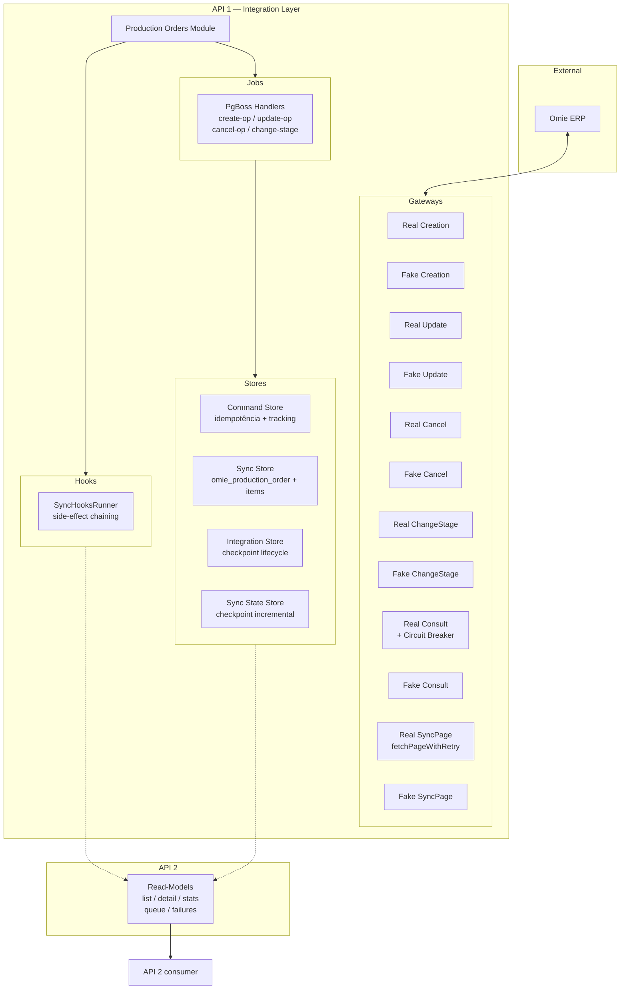
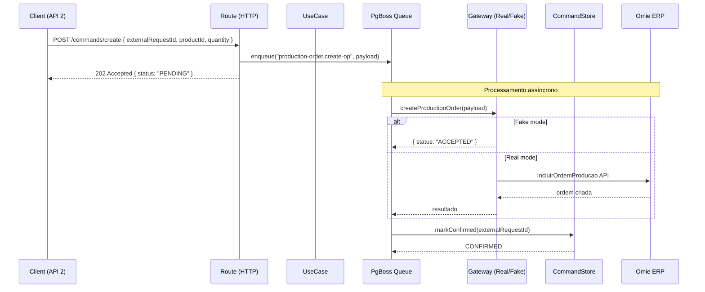

# 📦 Production Orders — Integration Module

> 🔄 **Módulo de Integração de Ordens de Produção** — Gerencia sincronização bidirecional  
> de ordens de produção entre o sistema local e o Omie (ERP).

**Documentação:** Rotas completas com curl ↓ | Arquitetura ↓ | Dev/Prod guide ↓

---

## 📋 Índice

- [1. Visão Geral](#1-visão-geral)
- [2. Arquitetura](#2-arquitetura)
- [3. Estrutura do Módulo](#3-estrutura-do-módulo)
- [4. Rotas da API (Referência Completa)](#4-rotas-da-api-referência-completa)
- [5. Fluxos de Operação](#5-fluxos-de-operação)
- [6. Padrão Real / Fake](#6-padrão-real--fake)
- [7. Configuração (Env Vars)](#7-configuração-env-vars)
- [8. Hooks Pós-Sync](#8-hooks-pós-sync)
- [9. Desenvolvimento](#9-desenvolvimento)
- [10. Produção](#10-produção)
- [11. Schema do Banco](#11-schema-do-banco)
- [12. Limitações Conhecidas](#12-limitações-conhecidas)
- [13. Checklist de Code Review](#13-checklist-de-code-review)
- [14. Regras de Ouro (Imutáveis)](#14-regras-de-ouro-imutáveis)

---

## 1. Visão Geral

### 🎯 Objetivo

Representa a **capacidade externa de Ordens de Produção (OP)**, cuja fonte de verdade é o **Omie (ERP)**.

**Responsabilidades:**
- Buscar/sincronizar ordens de produção do Omie (espelho local)
- Criar, atualizar, cancelar e alterar etapa de OPs no Omie via comandos assíncronos
- Persistir o estado de integração (command queue + espelho local)
- Expor read-models estáveis para consumo da API 2
- Suportar refresh individual de OP diretamente do Omie (síncrono)

### 🧠 Classificação Arquitetural

✅ **Tipo A — Módulo de Integração Externa**

| Critério | Atende? |
|---|---|
| Fala com Omie | ✅ |
| Dados não nascem no domínio | ✅ |
| Pode falhar por indisponibilidade externa | ✅ |
| Precisa de Fake para DEV / TEST / UX | ✅ |

👉 **Por definição, este módulo DEVE usar o padrão Real/Fake.**

### 🏗️ Contexto Geral

```
FRONTEND (UX)
    ↓ chamadas de domínio
API 2 (domínio, decisões humanas)
    ↓ consume read-models | envia comandos
API 1 (integração, Anti-Corruption Layer)
    ↓ chamadas Omie
OMIE (ERP)
```

**Regras de Ouro da Arquitetura:**
- **API 2 nunca chama Omie**
- **Front nunca chama API 1**
- **Todo efeito colateral passa pela API 1** (via PgBoss)
- **Read-models não executam efeitos colaterais**
- **Comandos SEMPRE retornam 202 Accepted**
- **Idempotência SEMPRE via `externalRequestId`**

---

## 2. Arquitetura

### Diagrama de Contexto (Módulo)



### Fluxo de um Comando Típico



---

## 3. Estrutura do Módulo

### 📁 Árvore de Arquivos (60+ arquivos)

```
modules/integration/production-orders/
│
├── index.ts                                    # Exporta register
├── production-orders-integration-register.ts   # Ponto de entrada no bootstrap
├── README.md                                   # ← Você está aqui
│
├── application/
│   ├── dto/
│   │   ├── sync-all-production-orders.dto.ts
│   │   ├── create-production-order.dto.ts
│   │   ├── update-production-order.dto.ts
│   │   ├── cancel-production-order.dto.ts
│   │   ├── change-stage-production-order.dto.ts
│   │   ├── reconcile.dto.ts              # (C3)
│   │   └── invalidate.dto.ts             # (C3)
│   │
│   ├── ports/
│   │   └── production-order-sync-page.gateway.ts
│   │
│   └── use-cases/
│       ├── sync-all-production-orders.usecase.ts
│       ├── process-create-production-order.usecase.ts
│       ├── process-update-production-order.usecase.ts
│       ├── process-cancel-production-order.usecase.ts
│       ├── process-change-stage-production-order.usecase.ts
│       ├── refresh-production-order-read-model.usecase.ts
│       └── create-production-order.usecase.ts          (legacy síncrono)
│
├── domain/
│   └── gateways/
│       └── lifecycle/
│           └── production-order-lifecycle.gateway.ts    (port type)
│
├── infrastructure/
│   ├── db/
│   │   ├── production-order-command.store.ts
│   │   ├── production-order-integration.store.ts
│   │   ├── production-order-read-model.store.ts
│   │   └── production-order-sync.store.ts
│   │
│   ├── gateways/
│   │   ├── creation/        (port + Real + Fake)
│   │   ├── update/          (port + Real + Fake)
│   │   ├── cancel/          (port + Real + Fake)
│   │   ├── change-stage/    (port + Real + Fake)
│   │   ├── consult/         (port + Real + Fake)
│   │   ├── query/           (port + Real + Fake)
│   │   ├── sync-page/       (Real + Fake)
│   │   └── lifecycle/       (port + Real + Fake)
│   │
│   └── jobs/
│       ├── production-order-jobs.handler.ts     # Bridge pura
│       └── production-order-jobs.register.ts
│
└── presentation/
    └── http/
        ├── routes.ts                             # Agrega todas as rotas
        ├── schemas.ts                            # Schemas Zod de validação
        ├── openapi.ts                            # Documentação OpenAPI 3.0
        ├── routes/
        │   ├── commands/
        │   │   ├── create-production-order.route.ts
        │   │   ├── update-production-order.route.ts
        │   │   ├── cancel-production-order.route.ts
        │   │   ├── change-production-order-stage.route.ts
        │   │   ├── sync-all-production-orders.route.ts
        │   │   └── get-production-order-status.route.ts
        │   ├── callbacks/
        │   │   ├── confirm-production-order.callback.route.ts
        │   │   └── fail-production-order.callback.route.ts
        │   └── read/
        │       ├── list-production-orders.route.ts
        │       ├── get-production-order.route.ts
        │       ├── get-production-order-stats.route.ts
        │       ├── get-queue-status.route.ts
        │       ├── get-queue-failures.route.ts
        │       └── get-production-order-refresh.route.ts
        └── controllers/                          (legacy — migrar para use-cases)
```

---

## 4. Rotas da API (Referência Completa)

> **24 rotas no total:** 9 commands (8 POST + 1 GET), 2 callbacks (POST), 13 read-models (GET).

### 4.1 Commands (Intenções)

#### `POST /v1/integration/production-orders/commands/create`
Cria uma ordem de produção no Omie (assíncrono via PgBoss).

**Request body:**
```json
{
  "externalRequestId": "uuid-v4",
  "productId": "12345",
  "quantity": 100,
  "scheduledDate": "2026-05-01",
  "notes": "Produção urgente"
}
```

**Response `202`:**
```json
{
  "success": true,
  "data": {
    "externalRequestId": "uuid-v4",
    "status": "PENDING"
  }
}
```

**curl:**
```bash
curl -X POST http://localhost:3333/v1/integration/production-orders/commands/create \
  -H "Content-Type: application/json" \
  -d '{"externalRequestId":"test-001","productId":"12345","quantity":100}'
```

---

#### `POST /v1/integration/production-orders/commands/update`
Atualiza uma ordem de produção no Omie (assíncrono via PgBoss).

**Request body:**
```json
{
  "externalRequestId": "uuid-v4",
  "omieCode": "OP-12345",
  "quantity": 150,
  "forecastDate": "2026-06-01",
  "notes": "Atualização de quantidade"
}
```

**curl:**
```bash
curl -X POST http://localhost:3333/v1/integration/production-orders/commands/update \
  -H "Content-Type: application/json" \
  -d '{"externalRequestId":"test-002","omieCode":"OP-12345","quantity":150}'
```

---

#### `POST /v1/integration/production-orders/commands/cancel`
Cancela uma ordem de produção no Omie (assíncrono via PgBoss).

**Request body:**
```json
{
  "externalRequestId": "uuid-v4",
  "omieCode": "OP-12345",
  "reason": "Cancelamento por solicitação do cliente"
}
```

**curl:**
```bash
curl -X POST http://localhost:3333/v1/integration/production-orders/commands/cancel \
  -H "Content-Type: application/json" \
  -d '{"externalRequestId":"test-003","omieCode":"OP-12345","reason":"Cliente desistiu"}'
```

---

#### `POST /v1/integration/production-orders/commands/change-stage`
Altera a etapa de uma ordem de produção no Omie (assíncrono via PgBoss).

**Request body:**
```json
{
  "externalRequestId": "uuid-v4",
  "omieCode": "OP-12345",
  "stage": "EM_PRODUCAO"
}
```

**curl:**
```bash
curl -X POST http://localhost:3333/v1/integration/production-orders/commands/change-stage \
  -H "Content-Type: application/json" \
  -d '{"externalRequestId":"test-004","omieCode":"OP-12345","stage":"EM_PRODUCAO"}'
```

---

#### `POST /v1/integration/production-orders/commands/sync-global`
Sincroniza globalmente todas as ordens de produção do Omie (checkpoint incremental).

**Request body** (opcional):
```json
{
  "externalRequestId": "uuid-v4",
  "pageSize": 100,
  "maxPages": 1000
}
```

**curl:**
```bash
curl -X POST http://localhost:3333/v1/integration/production-orders/commands/sync-global \
  -H "Content-Type: application/json" \
  -d '{"externalRequestId":"test-sync-001"}'
```

---

#### `POST /v1/integration/production-orders/commands/sync-incremental`
Sincronização incremental: busca apenas OPs alteradas desde a última sync (C1-P0).

**Request body** (opcional):
```json
{
  "externalRequestId": "uuid-v4",
  "pageSize": 100,
  "maxPages": 500
}
```

**curl:**
```bash
curl -X POST http://localhost:3333/v1/integration/production-orders/commands/sync-incremental \
  -H "Content-Type: application/json" \
  -d '{"externalRequestId":"test-sync-inc-001"}'
```

---

#### `POST /v1/integration/production-orders/commands/retry-failed`
Re-enfileira comandos FAILED como PENDING (C1-P0).

**Request body** (opcional):
```json
{
  "externalRequestId": "uuid-v4",
  "limit": 50
}
```

**curl:**
```bash
curl -X POST http://localhost:3333/v1/integration/production-orders/commands/retry-failed \
  -H "Content-Type: application/json" \
  -d '{"limit":10}'
```

---

#### `POST /v1/integration/production-orders/commands/reconcile` (C3)
Enfileira reconciliação: verifica se OPs no Omie correspondem ao read-model.

**Request body** (opcional):
```json
{
  "externalRequestId": "uuid-v4",
  "omieId": "OP-12345"
}
```

**curl:**
```bash
curl -X POST http://localhost:3333/v1/integration/production-orders/commands/reconcile \
  -H "Content-Type: application/json" \
  -d '{"externalRequestId":"test-rec-001"}'
```

---

#### `POST /v1/integration/production-orders/commands/invalidate` (C3)
Invalida o read-model de uma OP específica, forçando rebuild.

**Request body:**
```json
{
  "externalRequestId": "uuid-v4",
  "omieId": "OP-12345"
}
```

**curl:**
```bash
curl -X POST http://localhost:3333/v1/integration/production-orders/commands/invalidate \
  -H "Content-Type: application/json" \
  -d '{"externalRequestId":"test-inv-001","omieId":"OP-12345"}'
```

---

#### `POST /v1/integration/production-orders/commands/rebuild` (C3)
Dispara rebuild completo: sync global + refresh do read model.

**Request body** (opcional):
```json
{
  "externalRequestId": "uuid-v4",
  "pageSize": 100,
  "maxPages": 500
}
```

**curl:**
```bash
curl -X POST http://localhost:3333/v1/integration/production-orders/commands/rebuild \
  -H "Content-Type: application/json" \
  -d '{"externalRequestId":"test-rbl-001"}'
```

---

### 4.2 Tracking

#### `GET /v1/integration/production-orders/commands/:externalRequestId`
Consulta o status de um comando de integração.

**curl:**
```bash
curl http://localhost:3333/v1/integration/production-orders/commands/test-001
```

**Response `200`:**
```json
{
  "success": true,
  "data": {
    "externalRequestId": "test-001",
    "commandType": "CREATE_OP",
    "status": "CONFIRMED",
    "source": "API2",
    "lastError": null,
    "retryCount": 0,
    "createdAt": "2026-04-14T10:00:00.000Z",
    "updatedAt": "2026-04-14T10:00:05.000Z"
  }
}
```

---

### 4.3 Callbacks (Fake-only)

#### `POST /v1/integration/production-orders/callbacks/:externalRequestId/confirm`
**FAKE ONLY** — Marca um comando como CONFIRMED.

**curl:**
```bash
curl -X POST http://localhost:3333/v1/integration/production-orders/callbacks/test-001/confirm
```

**Response `200`:**
```json
{ "success": true, "data": { "externalRequestId": "test-001", "status": "CONFIRMED" } }
```

---

#### `POST /v1/integration/production-orders/callbacks/:externalRequestId/fail`
**FAKE ONLY** — Marca um comando como FAILED.

**curl:**
```bash
curl -X POST http://localhost:3333/v1/integration/production-orders/callbacks/test-001/fail \
  -H "Content-Type: application/json" \
  -d '{"code":"ERRO_SIMULADO","message":"Falha simulada para testes"}'
```

---

### 4.4 Read-Models (Espelho Local)

#### `GET /v1/integration/production-orders/read`
Lista paginada do espelho local de ordens de produção.

**Parâmetros query:** `page`, `limit`, `completed`, `active`, `productCode`

**curl:**
```bash
curl "http://localhost:3333/v1/integration/production-orders/read?page=1&limit=20"
```

---

#### `GET /v1/integration/production-orders/read/list-unified` (C1)
Lista unificada com filtros avançados: `isOpen`, `isLate`, `hasStockIssues`, `productCode`, `page`, `limit`.

**curl:**
```bash
curl "http://localhost:3333/v1/integration/production-orders/read/list-unified?isOpen=true&isLate=true&limit=20"
```

---

#### `GET /v1/integration/production-orders/read/stock-issues` (C2)
Lista OPs com problemas de estoque. Filtro `type`: `missing`, `critical`, `partial`, `any`.

**curl:**
```bash
curl "http://localhost:3333/v1/integration/production-orders/read/stock-issues?type=missing&limit=20"
```

---

#### `GET /v1/integration/production-orders/read/by-number/:orderNumber` (C2)
Busca OP pelo número da ordem (`orderNumber`).

**curl:**
```bash
curl "http://localhost:3333/v1/integration/production-orders/read/by-number/OP-12345"
```

---

#### `GET /v1/integration/production-orders/read/summary/:omieCode` (C1)
Sumário consolidado de uma OP: totais de quantidade planejada vs. produzida.

**curl:**
```bash
curl "http://localhost:3333/v1/integration/production-orders/read/summary/OP-12345"
```

---

#### `GET /v1/integration/production-orders/read/consumption/:omieCode` (C1)
Detalhamento de consumo de materiais de uma OP.

**curl:**
```bash
curl "http://localhost:3333/v1/integration/production-orders/read/consumption/OP-12345"
```

---

#### `GET /v1/integration/production-orders/read/commands` (C2)
Histórico da fila de comandos de integração. Filtros: `status`, `commandType`, `limit`.

**curl:**
```bash
curl "http://localhost:3333/v1/integration/production-orders/read/commands?status=FAILED&limit=10"
```

---

#### `GET /v1/integration/production-orders/read/sync-state` (C3)
Status consolidado da sincronização: último sync, contagens do read-model, contagens da fila.

**curl:**
```bash
curl "http://localhost:3333/v1/integration/production-orders/read/sync-state"
```

---

#### `GET /v1/integration/production-orders/read/:omieCode`
Detalhe de uma OP + itens do espelho local.

**curl:**
```bash
curl http://localhost:3333/v1/integration/production-orders/read/OP-12345
```

---

#### `GET /v1/integration/production-orders/read/stats`
Estatísticas do espelho local (total, confirmadas, falhas, etc.).

**curl:**
```bash
curl http://localhost:3333/v1/integration/production-orders/read/stats
```

---

#### `GET /v1/integration/production-orders/read/queue`
Status da fila de comandos (contagens por status + comandos recentes).

**curl:**
```bash
curl http://localhost:3333/v1/integration/production-orders/read/queue
```

---

#### `GET /v1/integration/production-orders/read/queue/failures`
Comandos com falha mais recentes.

**curl:**
```bash
curl http://localhost:3333/v1/integration/production-orders/read/queue/failures
```

---

#### `GET /v1/integration/production-orders/read/:omieCode/refresh`
Consulta a OP diretamente no Omie, atualiza o espelho local e retorna dados frescos. **Síncrona** — sem fila.

**curl:**
```bash
curl http://localhost:3333/v1/integration/production-orders/read/OP-12345/refresh
```

---

## 5. Fluxos de Operação

### 5.1 Criação de OP (Assíncrona)

1. API 2 envia `POST /commands/create` com `externalRequestId`, `productId`, `quantity`
2. Rota enfileira job `production-order.create-op` no PgBoss e retorna 202
3. PgBoss worker executa `ProcessCreateProductionOrderUseCase`
4. Se modo real: chama Omie via `RealCreationGateway`
5. Worker cria registro de auditoria no CommandStore e marca como CONFIRMED

### 5.2 Sync Global (Checkpoint Incremental)

1. API 2 envia `POST /commands/sync-global` com `externalRequestId`
2. `SyncAllProductionOrdersUseCase` percorre páginas do Omie
3. Usa `PrismaSyncStateStore` para checkpoint incremental (`lastSyncAt`)
4. Entre páginas: `await sleep(700)` — rate-limit
5. A cada 10 páginas: log de checkpoint
6. Ao final: executa hooks via `SyncHooksRunner` (se houver)

### 5.3 Refresh Individual (Síncrono)

1. API 2 envia `GET /read/:omieCode/refresh`
2. Rota consulta Omie via `RealProductionOrderConsultGateway` (com circuit breaker)
3. Atualiza espelho local via `ProductionOrderSyncStore.save()`
4. Retorna dados frescos diretamente

---

## 6. Padrão Real / Fake

Todas as portas de gateway possuem duas implementações:

| Gateway | Real | Fake | Critério de Seleção |
|---|---|---|---|
| Creation | `RealProductionOrderCreationGateway` | `FakeProductionOrderCreationGateway` | `env.PRODUCTION_ORDER_GATEWAY` |
| Update | `RealProductionOrderUpdateGateway` | `FakeProductionOrderUpdateGateway` | `env.PRODUCTION_ORDER_GATEWAY` |
| Cancel | `RealProductionOrderCancelGateway` | `FakeProductionOrderCancelGateway` | `env.PRODUCTION_ORDER_GATEWAY` |
| ChangeStage | `RealProductionOrderChangeStageGateway` | `FakeProductionOrderChangeStageGateway` | `env.PRODUCTION_ORDER_GATEWAY` |
| Consult | `RealProductionOrderConsultGateway` | `FakeProductionOrderConsultGateway` | `env.PRODUCTION_ORDER_GATEWAY` |
| Query | `RealProductionOrderQueryGateway` | `FakeProductionOrderQueryGateway` | `env.PRODUCTION_ORDER_GATEWAY` |
| SyncPage | `RealProductionOrderSyncPageGateway` | `FakeProductionOrderSyncPageGateway` | `env.PRODUCTION_ORDER_GATEWAY` |
| Lifecycle | `RealProductionOrderLifecycleGateway` | `FakeProductionOrderLifecycleGateway` | `env.PRODUCTION_ORDER_GATEWAY` |

**Callback routes (confirm/fail)** bloqueiam quando `PRODUCTION_ORDER_GATEWAY=real` — retornam 405.

---

## 7. Configuração (Env Vars)

| Variável | Obrigatória | Default | Descrição |
|---|---|---|---|
| `PRODUCTION_ORDER_GATEWAY` | ❌ | `"fake"` | `"fake"` ou `"real"` |
| `OMIE_APP_KEY` | ✅ (modo real) | — | Chave da API Omie |
| `OMIE_APP_SECRET` | ✅ (modo real) | — | Segredo da API Omie |
| `OMIE_BASE_URL` | ✅ (modo real) | — | URL base da API Omie |

---

## 8. Hooks Pós-Sync

O `SyncAllProductionOrdersUseCase` aceita um `SyncHooksRunner` opcional.
Se fornecido, executa hooks após o comando ser marcado como CONFIRMED.

```typescript
const hooks = new SyncHooksRunner();
hooks.add(async (ctx) => {
    logger.info("Hook pós-sync executado", ctx);
});
await useCase.execute(command, hooks);
```

Atualmente usado no `sync-all-production-orders.route.ts` (bridge entre rotas e use-case).

---

## 9. Desenvolvimento

### Setup local

```bash
# 1. Suba o banco
docker compose up -d

# 2. Inicie a API
pnpm --filter @production-manager/api dev

# 3. Gateway fake (padrão)
curl http://localhost:3333/v1/integration/production-orders/read
```

### Testando com Fake

```bash
# Cria OP (fake — enfileira job)
curl -X POST http://localhost:3333/v1/integration/production-orders/commands/create \
  -H "Content-Type: application/json" \
  -d '{"externalRequestId":"dev-test-1","productId":"123","quantity":50}'

# Confirma manualmente (fake only)
curl -X POST http://localhost:3333/v1/integration/production-orders/callbacks/dev-test-1/confirm

# Verifica status
curl http://localhost:3333/v1/integration/production-orders/commands/dev-test-1
```

---

## 10. Produção

Antes de ativar modo real:

1. Configure `PRODUCTION_ORDER_GATEWAY=real`
2. Valide credenciais Omie (`OMIE_APP_KEY`, `OMIE_APP_SECRET`, `OMIE_BASE_URL`)
3. Teste em staging com dados reais (sandbox Omie)
4. Verifique logs de erros e circuit breaker
5. Acompanhe fila de comandos via `/read/queue` e `/read/queue/failures`

---

## 11. Schema do Banco

Tabelas utilizadas pelo módulo:

| Tabela | Finalidade |
|---|---|
| `integration.production_order_command` | Fila de comandos (idempotência + tracking) |
| `omie_production_order` | Espelho local de OPs |
| `omie_production_order_item` | Itens da OP (produtos componentes) |
| `integration.sync_state` | Checkpoint de última sincronização |

---

## 12. Limitações Conhecidas

- ❌ **Lifecycle fake-only**: Callbacks HTTP (confirm/fail) só funcionam em modo fake. Em real, Omie gerencia o ciclo de vida externamente.
- ❌ **Sem cron de reconciliação**: Há rota `/commands/reconcile` para disparo manual, mas não há job agendado para reconciliação periódica.
- ❌ **Legacy síncrono**: `CreateProductionOrderUseCase` (sem sufixo) é legado síncrono — não usar.
- ✅ **Idempotência**: Garantida via `externalRequestId` + CommandStore.
- ✅ **Rate-limit**: `sleep(700)` entre páginas no sync global.

---

## 13. Checklist de Code Review

- [ ] Porta de gateway definida como `type` (não `interface`)
- [ ] Real gateway implementa a porta
- [ ] Fake gateway implementa a porta
- [ ] Seleção Real/Fake via `env.PRODUCTION_ORDER_GATEWAY`
- [ ] Comando retorna 202 Accepted
- [ ] Idempotência via `externalRequestId`
- [ ] Use-case registrado como handler PgBoss
- [ ] Tratamento de erro com fallback / retry
- [ ] Logs estruturados com `getLogger()`
- [ ] Rota de tracking (GET `/:externalRequestId`)
- [ ] Read-route prefixo correto: `/v1/integration/production-orders/read/`
- [ ] Command-route prefixo: `/v1/integration/production-orders/commands/`
- [ ] OpenAPI documentado em `openapi.ts`

---

## 14. Regras de Ouro (Imutáveis)

1. **Frontend nunca chama Omie ou API 1 diretamente**
2. **API 2 nunca chama Omie**
3. **Apenas API 1 fala com Omie** via gateways (real/fake)
4. **Read-models não executam efeitos colaterais**
5. **Comandos de integração sempre usam `externalRequestId`** (idempotência)
6. **Comandos retornam 202 Accepted** (eventual-consistente)
7. **Nunca importar Prisma direto nos use-cases** — usar stores
8. **Nunca misturar responsabilidades de diferentes módulos de integração**
    "data": {
      "externalRequestId": "string",
      "productId": "string",
      "quantity": "number",
      "scheduledDate": "string (optional)",
      "notes": "string (optional)",
      "status": "CONFIRMED",
      "omieProductionOrderId": "number (optional)",
      "createdAt": "string (ISO datetime)",
      "updatedAt": "string (ISO datetime)"
    }
  }
  ```
- `404 Not Found`: Ordem não encontrada
- `405 Method Not Allowed`: Quando `PRODUCTION_ORDER_GATEWAY=real`

---

### 4. **POST** `/v1/integration/production-orders/:externalRequestId/fail`
**FAKE ONLY** - Marca uma ordem de produção como falha (disponível apenas quando `PRODUCTION_ORDER_GATEWAY=fake`).

**Path Parameters:**
- `externalRequestId`: ID externo da ordem

**Request Body:**
```json
{
  "code": "string",
  "message": "string"
}
```

**Responses:**
- `200 OK`: Ordem marcada como falha
  ```json
  {
    "success": true,
    "data": {
      "externalRequestId": "string",
      "productId": "string",
      "quantity": "number",
      "scheduledDate": "string (optional)",
      "notes": "string (optional)",
      "status": "FAILED",
      "omieProductionOrderId": "number (optional)",
      "createdAt": "string (ISO datetime)",
      "updatedAt": "string (ISO datetime)",
      "lastError": {
        "code": "string",
        "message": "string"
      }
    }
  }
  ```
- `404 Not Found`: Ordem não encontrada
- `405 Method Not Allowed`: Quando `PRODUCTION_ORDER_GATEWAY=real`

---

## 🏗️ Arquitetura

```
production-orders/
├── index.ts
├── production-orders-integration-register.ts
├── README.md
├── application/
│   ├── dto/
│   │   ├── sync-all-production-orders.dto.ts
│   │   ├── create-production-order.dto.ts
│   │   ├── update-production-order.dto.ts
│   │   ├── cancel-production-order.dto.ts
│   │   ├── change-stage-production-order.dto.ts
│   │   ├── reconcile.dto.ts              # (C3)
│   │   └── invalidate.dto.ts             # (C3)
│   ├── ports/
│   │   ├── production-order-cancel.gateway.ts
│   │   ├── production-order-change-stage.gateway.ts
│   │   ├── production-order-consult.gateway.ts
│   │   ├── production-order-creation.gateway.ts
│   │   ├── production-order-integration.gateway.ts
│   │   ├── production-order-query.gateway.ts
│   │   ├── production-order-sync-page.gateway.ts
│   │   └── production-order-update.gateway.ts
│   └── use-cases/
│       ├── enqueue-cancel-production-order.usecase.ts
│       ├── enqueue-change-stage-production-order.usecase.ts
│       ├── enqueue-create-production-order.usecase.ts
│       ├── enqueue-update-production-order.usecase.ts
│       ├── process-cancel-production-order.usecase.ts
│       ├── process-change-stage-production-order.usecase.ts
│       ├── process-create-production-order.usecase.ts
│       ├── process-update-production-order.usecase.ts
│       ├── refresh-production-order-read-model.usecase.ts
│       └── sync-all-production-orders.usecase.ts
├── infrastructure/
│   ├── db/
│   │   ├── production-order-command.store.ts
│   │   ├── production-order-integration.store.ts
│   │   ├── production-order-query.store.ts
│   │   └── production-order-sync.store.ts
│   ├── gateways/
│   │   ├── cancel/
│   │   │   ├── fake-production-order-cancel.gateway.ts
│   │   │   └── real-production-order-cancel.gateway.ts
│   │   ├── change-stage/
│   │   │   ├── fake-production-order-change-stage.gateway.ts
│   │   │   └── real-production-order-change-stage.gateway.ts
│   │   ├── consult/
│   │   │   ├── fake-production-order-consult.gateway.ts
│   │   │   └── real-production-order-consult.gateway.ts
│   │   ├── creation/
│   │   │   ├── fake-production-order-creation.gateway.ts
│   │   │   └── real-production-order-creation.gateway.ts
│   │   ├── lifecycle/
│   │   │   ├── fake-production-order-lifecycle.gateway.ts
│   │   │   └── real-production-order-lifecycle.gateway.ts
│   │   ├── query/
│   │   │   ├── fake-production-order-query.gateway.ts
│   │   │   └── real-production-order-query.gateway.ts
│   │   ├── sync-page/
│   │   │   ├── fake-production-order-sync-page.gateway.ts
│   │   │   └── real-production-order-sync-page.gateway.ts
│   │   └── update/
│   │       ├── fake-production-order-update.gateway.ts
│   │       └── real-production-order-update.gateway.ts
│   └── jobs/
│       ├── production-order-jobs.handler.ts
│       ├── production-order-jobs.register.ts
│       └── sync-all-production-orders.job.ts
└── presentation/
    └── http/
        ├── routes.ts
        ├── schemas.ts
        ├── openapi.ts
        └── routes/
            ├── commands/
            │   ├── cancel-production-order.route.ts
            │   ├── change-production-order-stage.route.ts
            │   ├── create-production-order.route.ts
            │   ├── get-production-order-status.route.ts
            │   ├── invalidate.route.ts              # (C3)
            │   ├── rebuild.route.ts                 # (C3)
            │   ├── reconcile.route.ts               # (C3)
            │   ├── retry-failed.route.ts            # (C1-P0)
            │   ├── sync-all-production-orders.route.ts
            │   ├── sync-incremental.route.ts        # (C1-P0)
            │   └── update-production-order.route.ts
            ├── callbacks/
            │   ├── confirm-production-order.callback.route.ts
            │   └── fail-production-order.callback.route.ts
            └── read/
                ├── get-production-order-by-number.route.ts  # (C2)
                ├── get-production-order-consumption.route.ts # (C1)
                ├── get-production-order-refresh.route.ts
                ├── get-production-order-stats.route.ts
                ├── get-production-order-summary.route.ts     # (C1)
                ├── get-production-order.route.ts
                ├── get-queue-failures.route.ts
                ├── get-queue-status.route.ts
                ├── get-stock-issues.route.ts                 # (C2)
                ├── get-sync-state.route.ts                   # (C3)
                ├── list-production-order-commands.route.ts   # (C2)
                ├── list-production-orders-unified.route.ts   # (C1)
                └── list-production-orders.route.ts
```

---

## ⚙️ Configuração

**Variáveis de Ambiente:**
- `PRODUCTION_ORDER_GATEWAY`: `"fake"` (default) ou `"real"`
- `OMIE_APP_KEY`: Chave da API Omie (apenas para gateway real)
- `OMIE_APP_SECRET`: Segredo da API Omie (apenas para gateway real)
- `OMIE_BASE_URL`: URL base da API Omie (apenas para gateway real)

---

## 🔄 Fluxo de Integração

1. **API 2** → Envia comando para **API 1** via `POST /v1/integration/production-order`
2. **API 1** → Valida payload e seleciona gateway (fake/real)
3. **Gateway Fake** → Retorna `ACCEPTED` imediatamente (simulação)
4. **Gateway Real** → Chama API Omie (`IncluirOrdemProducao`)
5. **API 1** → Retorna resposta para **API 2**

---

## 🧪 Endpoints de Teste (Fake Only)

Quando `PRODUCTION_ORDER_GATEWAY=fake`, endpoints adicionais estão disponíveis para simulação:

1. **Confirmar Ordem**: `POST /v1/integration/production-orders/:id/confirm`
2. **Falhar Ordem**: `POST /v1/integration/production-orders/:id/fail`

Estes endpoints são **bloqueados** quando `PRODUCTION_ORDER_GATEWAY=real`.

---

## 📊 Status da Ordem

- `ACCEPTED`: Ordem aceita para processamento
- `CONFIRMED`: Ordem confirmada pelo sistema externo (fake only)
- `FAILED`: Falha na integração (fake only)

---

## 🔒 Segurança

- **API 1** é a única responsável por integrações externas
- **API 2** nunca faz chamadas diretas a sistemas externos
- Endpoints fake são protegidos por variável de ambiente

---

## 🚀 Uso em Produção

Para usar integração real com Omie:
1. Configure `PRODUCTION_ORDER_GATEWAY=real`
2. Forneça credenciais válidas da API Omie
3. Teste em ambiente de staging antes de produção

Para desenvolvimento/teste:
1. Mantenha `PRODUCTION_ORDER_GATEWAY=fake`
2. Use endpoints fake para simular diferentes cenários
