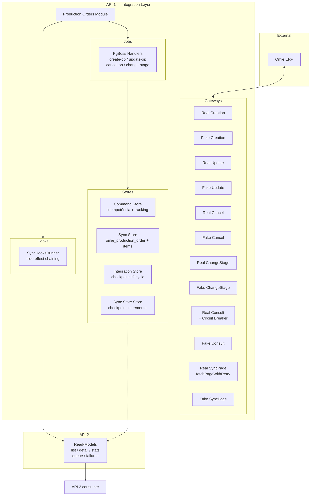
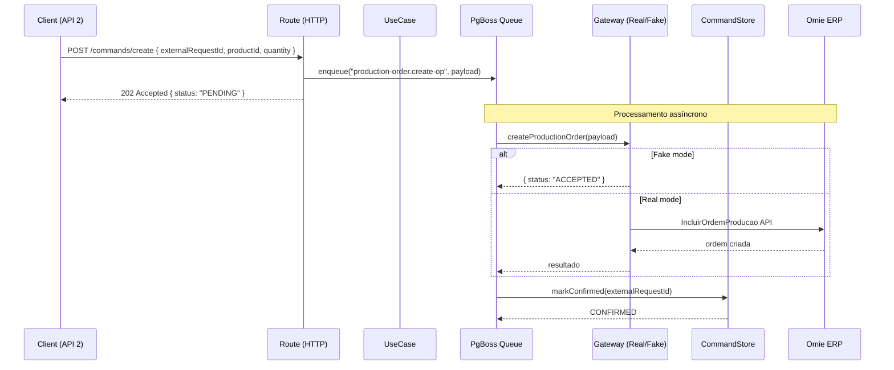

# 📦 Production Orders — Integration Module

> 🔄 **Módulo de Integração de Ordens de Produção** — Gerencia sincronização bidirecional  
> de ordens de produção entre o sistema local e o Omie (ERP).

**Documentação:** Rotas completas com curl ↓ | Arquitetura ↓ | Dev/Prod guide ↓

---

## 📋 Índice

- [1. Visão Geral](#1-visão-geral)
- [2. Arquitetura](#2-arquitetura)
- [3. Canonical Data Model (Omie → Sistema)](#3-canonical-data-model-omie--sistema)
- [4. Estrutura do Módulo](#4-estrutura-do-módulo)
- [5. Rotas da API (Referência Completa)](#5-rotas-da-api-referência-completa)
- [6. Fluxos de Operação](#6-fluxos-de-operação)
- [7. Padrão Real / Fake](#7-padrão-real--fake)
- [8. Configuração (Env Vars)](#8-configuração-env-vars)
- [9. Hooks Pós-Sync](#9-hooks-pós-sync)
- [10. Desenvolvimento](#10-desenvolvimento)
- [11. Produção](#11-produção)
- [12. Schema do Banco](#12-schema-do-banco)
- [13. Field Mapping Detalhado — Production Orders](#13-field-mapping-detalhado--production-orders)
- [14. Limitações Conhecidas](#14-limitações-conhecidas)
- [15. Checklist de Code Review](#15-checklist-de-code-review)
- [16. Regras de Ouro (Imutáveis)](#16-regras-de-ouro-imutáveis)

---

## 1. Visão Geral

### 🎯 Objetivo

Representa a **capacidade externa de Ordens de Produção (OP)**, cuja fonte de verdade é o **Omie (ERP)**.

**Responsabilidades:**
- Buscar/sincronizar ordens de produção do Omie (espelho local)
- Criar, atualizar, cancelar e alterar etapa de OPs no Omie via comandos assíncronos
- Persistir o estado de integração (command queue + espelho local)
- Expor read-models estáveis para consumo da API 2
- Suportar refresh individual de OP diretamente do Omie (síncrono)
- **Search UX:** Busca inteligente com autocomplete, scoring e normalização nos read-models (consulte `docs/SEARCH_UX.md`)
- **Admin:** Recalcular read-model e popular campos de busca indexados via `POST /v1/admin/production-orders/read-model/refresh`

### 🧠 Classificação Arquitetural

✅ **Tipo A — Módulo de Integração Externa**

| Critério | Atende? |
|---|---|
| Fala com Omie | ✅ |
| Dados não nascem no domínio | ✅ |
| Pode falhar por indisponibilidade externa | ✅ |
| Precisa de Fake para DEV / TEST / UX | ✅ |

👉 **Por definição, este módulo DEVE usar o padrão Real/Fake.**

### 🏗️ Contexto Geral

```
FRONTEND (UX)
    ↓ chamadas de domínio
API 2 (domínio, decisões humanas)
    ↓ consume read-models | envia comandos
API 1 (integração, Anti-Corruption Layer)
    ↓ chamadas Omie
OMIE (ERP)
```

**Regras de Ouro da Arquitetura:**
- **API 2 nunca chama Omie**
- **Front nunca chama API 1**
- **Todo efeito colateral passa pela API 1** (via PgBoss)
- **Read-models não executam efeitos colaterais**
- **Comandos SEMPRE retornam 202 Accepted**
- **Idempotência SEMPRE via `externalRequestId`**

---

## 2. Arquitetura

### Diagrama de Contexto (Módulo)



### Fluxo de um Comando Típico



---

## 3. Canonical Data Model (Omie → Sistema)

> 🔥 **Padronização cross-domain** — Define como os campos do Omie são mapeados para o sistema local.
> Este mapeamento cobre **todos os módulos de integração** (OP, Produto, Estoque, Estrutura).

### Regra Global de Nomenclatura

| Conceito | Regra | Exemplo |
|---|---|---|
| `omieId` | ID numérico da entidade no Omie (PK) | `9204166587` |
| `productOmieId` | `nCodProd` / `nCodProduto` do produto no Omie | `9116172062` |
| `productCode` | Código visível do produto (string) | `"PROD-001"` |
| `orderNumber` | Número visível da OP | `"2024/00002"` |
| `componentOmieId` | `nIdProdutoMalha` do componente na estrutura | `123456` |
| `componentCode` | Código visível do componente | `"COMP-001"` |

---

### 🏭 Ordem de Produção (OP) — `production-orders`

| Omie | Sistema | Tipo | Descrição |
|---|---|---|---|
| `identificacao.nCodOP` | `omieId` | `String` | ID único da OP no Omie |
| `identificacao.cNumOP` | `orderNumber` | `String?` | Número comercial da OP |
| `identificacao.nCodProduto` | `productOmieId` | `String?` | Código do produto no Omie |
| `identificacao.cCodIntProd` | `productIntegrationCode` | `String?` | Código de integração do produto |
| `identificacao.nQtde` | `quantity` | `String` | Quantidade planejada |
| `infAdicionais.cEtapa` | `stage` | `String?` | Etapa (ex: "40", "60", "80") |
| `outrasInf.cConcluida` | `completed` | `Boolean` | `"S"` = concluída |

---

### 📦 Produto — `product-structure`

| Omie | Sistema | Tipo | Descrição |
|---|---|---|---|
| `codigo_produto` | `productOmieId` | `String` | ID do produto no Omie |
| `codigo` | `productCode` | `String` | Código visível do produto |
| `descricao` | `description` | `String` | Descrição/nome do produto |
| `codigo_familia` | `familyCode` | `String?` | Código da família |
| `unidade` | `unit` | `String` | Unidade de medida |

---

### 📦 Estoque — `stock`

| Omie | Sistema | Tipo | Descrição |
|---|---|---|---|
| `nCodProd` | `productOmieId` | `String` | ID do produto no Omie |
| `cCodigo` | `productCode` | `String` | Código visível do produto |
| `fisico` | `stockQuantity` | `Decimal` | Quantidade física em estoque |
| `local` | `locationCode` | `String?` | Localização no depósito |

---

### 🏗️ Estrutura (BOM) — `product-structure`

| Omie | Sistema | Tipo | Descrição |
|---|---|---|---|
| `codProduto` | `productCode` | `String` | Código do produto pai |
| `idProduto` | `productOmieId` | `String` | ID do produto pai no Omie |
| `codProdMalha` | `componentCode` | `String` | Código do componente |
| `idProdMalha` | `componentOmieId` | `BigInt` | ID do componente na malha |
| `nIteGera` | `bomQuantity` | `Decimal` | Quantidade do componente no BOM |
| `nNivel` | `bomLevel` | `Int` | Nível hierárquico na estrutura |

---

### 🚨 Regras Críticas

1. ❌ **Nunca usar `omieCode` como ID numérico** — `omieCode` em payloads antigos representa `nCodOP` (string), não o ID numérico. Prefira `omieId`.
2. ✅ **Sempre usar `productOmieId` para lookup de estoque** — o campo numérico do Omie é a chave correta, não o código textual.
3. ✅ **Bridge é apenas para conversão** — o adapter (`OmieProductionOrdersAdapter.mapProductionOrder()`) faz a tradução dos campos. Nenhuma regra de negócio deve usar campos Omie diretamente.
4. ❌ **Nunca confundir `productCode` com `productOmieId`** — o primeiro é o código visível (ex: "PROD-001"), o segundo é o ID numérico interno do Omie (ex: 9116172062).
5. ✅ **Sempre documentar novos mapeamentos** — qualquer novo campo adicionado deve ser refletido neste canonical model.

> **🔍 Nota sobre `omieCode`:** O código já foi padronizado — **todas as rotas novas e existentes usam `omieId`**. O parâmetro `omieCode` não é mais aceito. Consulte a seção [3. Canonical Data Model](#3-canonical-data-model-omie--sistema) para a nomenclatura oficial.

---

## 4. Estrutura do Módulo

### 📁 Árvore de Arquivos (60+ arquivos)

```
modules/integration/production-orders/
│
├── index.ts                                    # Exporta register
├── production-orders-integration-register.ts   # Ponto de entrada no bootstrap
├── README.md                                   # ← Você está aqui
│
├── application/
│   ├── dto/
│   │   ├── sync-all-production-orders.dto.ts
│   │   ├── create-production-order.dto.ts
│   │   ├── update-production-order.dto.ts
│   │   ├── cancel-production-order.dto.ts
│   │   ├── change-stage-production-order.dto.ts
│   │   ├── reconcile.dto.ts              # (C3)
│   │   └── invalidate.dto.ts             # (C3)
│   │
│   ├── ports/
│   │   └── production-order-sync-page.gateway.ts
│   │
│   └── use-cases/
│       ├── sync-all-production-orders.usecase.ts
│       ├── process-create-production-order.usecase.ts
│       ├── process-update-production-order.usecase.ts
│       ├── process-cancel-production-order.usecase.ts
│       ├── process-change-stage-production-order.usecase.ts
│       ├── refresh-production-order-read-model.usecase.ts
│       └── create-production-order.usecase.ts          (legacy síncrono)
│
├── domain/
│   └── gateways/
│       └── lifecycle/
│           └── production-order-lifecycle.gateway.ts    (port type)
│
├── infrastructure/
│   ├── db/
│   │   ├── production-order-command.store.ts
│   │   ├── production-order-integration.store.ts
│   │   ├── production-order-query.store.ts
│   │   ├── production-order-read-model.store.ts
│   │   └── production-order-sync.store.ts
│   │
│   ├── gateways/
│   │   ├── creation/        (port + Real + Fake)
│   │   ├── update/          (port + Real + Fake)
│   │   ├── cancel/          (port + Real + Fake)
│   │   ├── change-stage/    (port + Real + Fake)
│   │   ├── consult/         (port + Real + Fake)
│   │   ├── query/           (port + Real + Fake)
│   │   ├── sync-page/       (Real + Fake)
│   │   └── lifecycle/       (port + Real + Fake)
│   │
│   └── jobs/
│       ├── production-order-jobs.handler.ts     # Bridge pura
│       └── production-order-jobs.register.ts
│
└── presentation/
    └── http/
        ├── routes.ts                             # Agrega todas as rotas
        ├── schemas.ts                            # Schemas Zod de validação
        ├── openapi.ts                            # Documentação OpenAPI 3.0
        ├── routes/
        │   ├── commands/
        │   │   ├── cancel-production-order.route.ts
        │   │   ├── change-production-order-stage.route.ts
        │   │   ├── create-production-order.route.ts
        │   │   ├── get-production-order-status.route.ts
        │   │   ├── invalidate.route.ts              # (C3)
        │   │   ├── rebuild.route.ts                 # (C3)
        │   │   ├── reconcile.route.ts               # (C3)
        │   │   ├── retry-failed.route.ts            # (C1-P0)
        │   │   ├── sync-all-production-orders.route.ts
        │   │   ├── sync-incremental.route.ts        # (C1-P0)
        │   │   └── update-production-order.route.ts
        │   ├── callbacks/
        │   │   ├── confirm-production-order.callback.route.ts
        │   │   └── fail-production-order.callback.route.ts
        │   ├── admin/
        │   │   └── refresh-production-order-read-model.route.ts
        │   └── read/
        │       ├── get-consumption-summary-by-id.route.ts      # (C1)
        │       ├── get-consumption-summary.route.ts            # (C1)
        │       ├── get-production-order-by-number.route.ts     # (C2)
        │       ├── get-production-order-consumption.route.ts   # (C1)
        │       ├── get-production-order-refresh.route.ts
        │       ├── get-production-order-stats.route.ts
        │       ├── get-production-order-summary-by-id.route.ts # (C1)
        │       ├── get-production-order-summary.route.ts       # (C1)
        │       ├── get-production-order-with-bom.route.ts
        │       ├── get-production-order.route.ts
        │       ├── get-queue-failures.route.ts
        │       ├── get-queue-status.route.ts
        │       ├── get-stock-issues.route.ts                   # (C2)
        │       ├── get-sync-state.route.ts                     # (C3)
        │       ├── list-open-production-orders.route.ts
        │       ├── list-production-order-commands.route.ts     # (C2)
        │       ├── list-production-orders.route.ts
        │       ├── list-unified-production-orders.route.ts     # (C1)
        │       └── search-suggestions.route.ts                 # Search UX
```
```

---

## 5. Rotas da API (Referência Completa)

> **33 rotas no total:** 11 commands (10 POST + 1 GET), 2 callbacks (POST), 19 read-models (GET), 1 admin (POST).

### 5.1 Commands (Intenções)

#### `POST /v1/integration/production-orders/commands/create`
Cria uma ordem de produção no Omie (assíncrono via PgBoss).

**Request body:**
```json
{
  "externalRequestId": "uuid-v4",
  "productId": "12345",
  "quantity": 100,
  "scheduledDate": "2026-05-01",
  "notes": "Produção urgente"
}
```

**Response `202`:**
```json
{
  "success": true,
  "data": {
    "externalRequestId": "uuid-v4",
    "status": "PENDING"
  }
}
```

**curl:**
```bash
curl -X POST http://localhost:3333/v1/integration/production-orders/commands/create \
  -H "Content-Type: application/json" \
  -d '{"externalRequestId":"test-001","productId":"12345","quantity":100}'
```

---

#### `POST /v1/integration/production-orders/commands/update`
Atualiza uma ordem de produção no Omie (assíncrono via PgBoss).

**Request body:**
```json
{
  "externalRequestId": "uuid-v4",
  "omieId": "9204166587",
  "quantity": 150,
  "forecastDate": "2026-06-01",
  "notes": "Atualização de quantidade"
}
```

**curl:**
```bash
curl -X POST http://localhost:3333/v1/integration/production-orders/commands/update \
  -H "Content-Type: application/json" \
  -d '{"externalRequestId":"test-002","omieId":"9204166587","quantity":150}'
```

---

#### `POST /v1/integration/production-orders/commands/cancel`
Cancela uma ordem de produção no Omie (assíncrono via PgBoss).

**Request body:**
```json
{
  "externalRequestId": "uuid-v4",
  "omieId": "9204166587",
  "reason": "Cancelamento por solicitação do cliente"
}
```

**curl:**
```bash
curl -X POST http://localhost:3333/v1/integration/production-orders/commands/cancel \
  -H "Content-Type: application/json" \
  -d '{"externalRequestId":"test-003","omieId":"9204166587","reason":"Cliente desistiu"}'
```

---

#### `POST /v1/integration/production-orders/commands/change-stage`
Altera a etapa de uma ordem de produção no Omie (assíncrono via PgBoss).

**Request body:**
```json
{
  "externalRequestId": "uuid-v4",
  "omieId": "9204166587",
  "stage": "EM_PRODUCAO"
}
```

**curl:**
```bash
curl -X POST http://localhost:3333/v1/integration/production-orders/commands/change-stage \
  -H "Content-Type: application/json" \
  -d '{"externalRequestId":"test-004","omieId":"9204166587","stage":"EM_PRODUCAO"}'
```

---

#### `POST /v1/integration/production-orders/commands/sync-global`
Sincroniza globalmente todas as ordens de produção do Omie (checkpoint incremental).

**Request body** (opcional):
```json
{
  "externalRequestId": "uuid-v4",
  "pageSize": 100,
  "maxPages": 1000
}
```

**curl:**
```bash
curl -X POST http://localhost:3333/v1/integration/production-orders/commands/sync-global \
  -H "Content-Type: application/json" \
  -d '{"externalRequestId":"test-sync-001"}'
```

---

#### `POST /v1/integration/production-orders/commands/sync-incremental`
Sincronização incremental: busca apenas OPs alteradas desde a última sync (C1-P0).

**Request body** (opcional):
```json
{
  "externalRequestId": "uuid-v4",
  "pageSize": 100,
  "maxPages": 500
}
```

**curl:**
```bash
curl -X POST http://localhost:3333/v1/integration/production-orders/commands/sync-incremental \
  -H "Content-Type: application/json" \
  -d '{"externalRequestId":"test-sync-inc-001"}'
```

---

#### `POST /v1/integration/production-orders/commands/retry-failed`
Re-enfileira comandos FAILED como PENDING (C1-P0).

**Request body** (opcional):
```json
{
  "externalRequestId": "uuid-v4",
  "limit": 50
}
```

**curl:**
```bash
curl -X POST http://localhost:3333/v1/integration/production-orders/commands/retry-failed \
  -H "Content-Type: application/json" \
  -d '{"limit":10}'
```

---

#### `POST /v1/integration/production-orders/commands/reconcile` (C3)
Enfileira reconciliação: verifica se OPs no Omie correspondem ao read-model.

**Request body** (opcional):
```json
{
  "externalRequestId": "uuid-v4",
  "omieId": "OP-12345"
}
```

**curl:**
```bash
curl -X POST http://localhost:3333/v1/integration/production-orders/commands/reconcile \
  -H "Content-Type: application/json" \
  -d '{"externalRequestId":"test-rec-001"}'
```

---

#### `POST /v1/integration/production-orders/commands/invalidate` (C3)
Invalida o read-model de uma OP específica, forçando rebuild.

**Request body:**
```json
{
  "externalRequestId": "uuid-v4",
  "omieId": "OP-12345"
}
```

**curl:**
```bash
curl -X POST http://localhost:3333/v1/integration/production-orders/commands/invalidate \
  -H "Content-Type: application/json" \
  -d '{"externalRequestId":"test-inv-001","omieId":"OP-12345"}'
```

---

#### `POST /v1/integration/production-orders/commands/rebuild` (C3)
Dispara rebuild completo: sync global + refresh do read model.

**Request body** (opcional):
```json
{
  "externalRequestId": "uuid-v4",
  "pageSize": 100,
  "maxPages": 500
}
```

**curl:**
```bash
curl -X POST http://localhost:3333/v1/integration/production-orders/commands/rebuild \
  -H "Content-Type: application/json" \
  -d '{"externalRequestId":"test-rbl-001"}'
```

---

### 5.2 Tracking

#### `GET /v1/integration/production-orders/commands/:externalRequestId`
Consulta o status de um comando de integração.

**curl:**
```bash
curl http://localhost:3333/v1/integration/production-orders/commands/test-001
```

**Response `200`:**
```json
{
  "success": true,
  "data": {
    "externalRequestId": "test-001",
    "commandType": "CREATE_OP",
    "status": "CONFIRMED",
    "source": "API2",
    "lastError": null,
    "retryCount": 0,
    "createdAt": "2026-04-14T10:00:00.000Z",
    "updatedAt": "2026-04-14T10:00:05.000Z"
  }
}
```

---

### 5.3 Callbacks (Fake-only)

#### `POST /v1/integration/production-orders/callbacks/:externalRequestId/confirm`
**FAKE ONLY** — Marca um comando como CONFIRMED.

**curl:**
```bash
curl -X POST http://localhost:3333/v1/integration/production-orders/callbacks/test-001/confirm
```

**Response `200`:**
```json
{ "success": true, "data": { "externalRequestId": "test-001", "status": "CONFIRMED" } }
```

---

#### `POST /v1/integration/production-orders/callbacks/:externalRequestId/fail`
**FAKE ONLY** — Marca um comando como FAILED.

**curl:**
```bash
curl -X POST http://localhost:3333/v1/integration/production-orders/callbacks/test-001/fail \
  -H "Content-Type: application/json" \
  -d '{"code":"ERRO_SIMULADO","message":"Falha simulada para testes"}'
```

---

### 5.4 Read-Models (Espelho Local)

#### `GET /v1/integration/production-orders/read`
Lista paginada do espelho local de ordens de produção.

**Parâmetros query:** `page`, `limit`, `completed`, `active`, `productCode`

**curl:**
```bash
curl "http://localhost:3333/v1/integration/production-orders/read?page=1&limit=20"
```

---

#### `GET /v1/integration/production-orders/read/list-unified` (C1)
Lista unificada com filtros avançados: `q`, `isOpen`, `isLate`, `hasStockIssues`, `productCode`, `page`, `limit`.

**Parâmetro `q` (Search UX):** Ativa busca inteligente com:
- Detecção automática do tipo de consulta (`detectQueryType`)
- Busca ponderada por: `orderNumber`, `productCode`, `productName`, `stageName`, `omieId`
- Score de relevância com reordenação pós-consulta (ALL = 5, PARTIAL = 2)
- Normalização (remoção de acentos + lowercase) nos campos indexados
- Compatível com tokenização multi-palavra (mín. 2 caracteres por token)

> 📖 Consulte `docs/SEARCH_UX.md` para detalhes completos da infraestrutura de busca.

**curl:**
```bash
curl "http://localhost:3333/v1/integration/production-orders/read/list-unified?q=Planejada&limit=20"
curl "http://localhost:3333/v1/integration/production-orders/read/list-unified?isOpen=true&isLate=true&limit=20"
```

---

#### `GET /v1/integration/production-orders/read/stock-issues` (C2)
Lista OPs com problemas de estoque. Filtro `type`: `missing`, `critical`, `partial`, `any`.

**curl:**
```bash
curl "http://localhost:3333/v1/integration/production-orders/read/stock-issues?type=missing&limit=20"
```

---

#### `GET /v1/integration/production-orders/read/by-number/:orderNumber` (C2)
Busca OP pelo número da ordem (`orderNumber`).

**curl:**
```bash
curl "http://localhost:3333/v1/integration/production-orders/read/by-number/2024%2F00002"
```

---

#### `GET /v1/integration/production-orders/read/summary/:omieId` (C1)
Sumário consolidado de uma OP: totais de quantidade planejada vs. produzida.

**curl:**
```bash
curl "http://localhost:3333/v1/integration/production-orders/read/summary/9204166587"
```

---

#### `GET /v1/integration/production-orders/read/consumption/:omieId` (C1)
Detalhamento de consumo de materiais de uma OP.

**curl:**
```bash
curl "http://localhost:3333/v1/integration/production-orders/read/consumption/9204166587"
```

---

#### `GET /v1/integration/production-orders/read/commands` (C2)
Histórico da fila de comandos de integração. Filtros: `status`, `commandType`, `limit`.

**curl:**
```bash
curl "http://localhost:3333/v1/integration/production-orders/read/commands?status=FAILED&limit=10"
```

---

#### `GET /v1/integration/production-orders/read/sync-state` (C3)
Status consolidado da sincronização: último sync, contagens do read-model, contagens da fila.

**curl:**
```bash
curl "http://localhost:3333/v1/integration/production-orders/read/sync-state"
```

---

#### `GET /v1/integration/production-orders/read/:omieId`
Detalhe de uma OP + itens do espelho local.

**curl:**
```bash
curl http://localhost:3333/v1/integration/production-orders/read/9204166587
```

---

#### `GET /v1/integration/production-orders/read/stats`
Estatísticas do espelho local (total, confirmadas, falhas, etc.).

**curl:**
```bash
curl http://localhost:3333/v1/integration/production-orders/read/stats
```

---

#### `GET /v1/integration/production-orders/read/queue`
Status da fila de comandos (contagens por status + comandos recentes).

**curl:**
```bash
curl http://localhost:3333/v1/integration/production-orders/read/queue
```

---

#### `GET /v1/integration/production-orders/read/queue/failures`
Comandos com falha mais recentes.

**curl:**
```bash
curl http://localhost:3333/v1/integration/production-orders/read/queue/failures
```

---

#### `GET /v1/integration/production-orders/read/:omieId/refresh`
Consulta a OP diretamente no Omie, atualiza o espelho local e retorna dados frescos. **Síncrona** — sem fila.

**curl:**
```bash
curl http://localhost:3333/v1/integration/production-orders/read/9204166587/refresh
```

---

#### `GET /v1/integration/production-orders/read/search-suggestions?q=` (Search UX)
Autocomplete de busca: retorna sugestões com base em prefixo match contra `productName`, `productCode`, `orderNumber`, `stageName`.

**Parâmetros query:** `q` (obrigatório, mínimo 2 caracteres)

**curl:**
```bash
curl "http://localhost:3333/v1/integration/production-orders/read/search-suggestions?q=FAB"
```

---

#### `GET /v1/integration/production-orders/read/consumption-summary` (C1)
Sumário agregado de consumo de materiais (dashboard). Retorna totais consolidados de todos os consumos.

**curl:**
```bash
curl "http://localhost:3333/v1/integration/production-orders/read/consumption-summary"
```

---

#### `GET /v1/integration/production-orders/read/consumption-summary/:omieId` (C1)
Sumário de consumo de materiais de uma OP específica.

**curl:**
```bash
curl "http://localhost:3333/v1/integration/production-orders/read/consumption-summary/9204166587"
```

---

#### `GET /v1/integration/production-orders/read/production-order-with-bom/:omieId`
Retorna a ordem de produção com sua estrutura (BOM) completa.

**curl:**
```bash
curl "http://localhost:3333/v1/integration/production-orders/read/production-order-with-bom/9204166587"
```

---

#### `GET /v1/integration/production-orders/read/list-open`
Lista OPs abertas (não concluídas) com paginação.

**curl:**
```bash
curl "http://localhost:3333/v1/integration/production-orders/read/list-open?page=1&limit=20"
```

---

### 5.5 Admin (Manutenção)

#### `POST /v1/admin/production-orders/read-model/refresh`
Recalcula o read-model de todas as OPs do espelho local. Executa `normalize()` e `resolveStage()` em cada registro para popular campos de busca indexados.

**curl:**
```bash
curl -X POST http://localhost:3333/v1/admin/production-orders/read-model/refresh
```

**Response `200`:**
```json
{
  "success": true,
  "data": {
    "totalProcessed": 1566,
    "message": "Read-model refreshed successfully"
  }
}
```

---

## 6. Fluxos de Operação

### 6.1 Criação de OP (Assíncrona)

1. API 2 envia `POST /commands/create` com `externalRequestId`, `productId`, `quantity`
2. Rota enfileira job `production-order.create-op` no PgBoss e retorna 202
3. PgBoss worker executa `ProcessCreateProductionOrderUseCase`
4. Se modo real: chama Omie via `RealCreationGateway`
5. Worker cria registro de auditoria no CommandStore e marca como CONFIRMED

### 6.2 Sync Global (Checkpoint Incremental)

1. API 2 envia `POST /commands/sync-global` com `externalRequestId`
2. `SyncAllProductionOrdersUseCase` percorre páginas do Omie
3. Usa `PrismaSyncStateStore` para checkpoint incremental (`lastSyncAt`)
4. Entre páginas: `await sleep(700)` — rate-limit
5. A cada 10 páginas: log de checkpoint
6. Ao final: executa hooks via `SyncHooksRunner` (se houver)

### 6.3 Refresh Individual (Síncrono)

1. API 2 envia `GET /read/:omieId/refresh`
2. Rota consulta Omie via `RealProductionOrderConsultGateway` (com circuit breaker)
3. Atualiza espelho local via `ProductionOrderSyncStore.save()`
4. Retorna dados frescos diretamente

---

## 7. Padrão Real / Fake

Todas as portas de gateway possuem duas implementações:

| Gateway | Real | Fake | Critério de Seleção |
|---|---|---|---|
| Creation | `RealProductionOrderCreationGateway` | `FakeProductionOrderCreationGateway` | `env.PRODUCTION_ORDER_GATEWAY` |
| Update | `RealProductionOrderUpdateGateway` | `FakeProductionOrderUpdateGateway` | `env.PRODUCTION_ORDER_GATEWAY` |
| Cancel | `RealProductionOrderCancelGateway` | `FakeProductionOrderCancelGateway` | `env.PRODUCTION_ORDER_GATEWAY` |
| ChangeStage | `RealProductionOrderChangeStageGateway` | `FakeProductionOrderChangeStageGateway` | `env.PRODUCTION_ORDER_GATEWAY` |
| Consult | `RealProductionOrderConsultGateway` | `FakeProductionOrderConsultGateway` | `env.PRODUCTION_ORDER_GATEWAY` |
| Query | `RealProductionOrderQueryGateway` | `FakeProductionOrderQueryGateway` | `env.PRODUCTION_ORDER_GATEWAY` |
| SyncPage | `RealProductionOrderSyncPageGateway` | `FakeProductionOrderSyncPageGateway` | `env.PRODUCTION_ORDER_GATEWAY` |
| Lifecycle | `RealProductionOrderLifecycleGateway` | `FakeProductionOrderLifecycleGateway` | `env.PRODUCTION_ORDER_GATEWAY` |

**Callback routes (confirm/fail)** bloqueiam quando `PRODUCTION_ORDER_GATEWAY=real` — retornam 405.

---

## 8. Configuração (Env Vars)

| Variável | Obrigatória | Default | Descrição |
|---|---|---|---|
| `PRODUCTION_ORDER_GATEWAY` | ❌ | `"fake"` | `"fake"` ou `"real"` |
| `OMIE_APP_KEY` | ✅ (modo real) | — | Chave da API Omie |
| `OMIE_APP_SECRET` | ✅ (modo real) | — | Segredo da API Omie |
| `OMIE_BASE_URL` | ✅ (modo real) | — | URL base da API Omie |

---

## 9. Hooks Pós-Sync

O `SyncAllProductionOrdersUseCase` aceita um `SyncHooksRunner` opcional.
Se fornecido, executa hooks após o comando ser marcado como CONFIRMED.

```typescript
const hooks = new SyncHooksRunner();
hooks.add(async (ctx) => {
    logger.info("Hook pós-sync executado", ctx);
});
await useCase.execute(command, hooks);
```

Atualmente usado no `sync-all-production-orders.route.ts` (bridge entre rotas e use-case).

---

## 10. Desenvolvimento

### Setup local

```bash
# 1. Suba o banco
docker compose up -d

# 2. Inicie a API
pnpm --filter @production-manager/api dev

# 3. Gateway fake (padrão)
curl http://localhost:3333/v1/integration/production-orders/read
```

### Testando com Fake

```bash
# Cria OP (fake — enfileira job)
curl -X POST http://localhost:3333/v1/integration/production-orders/commands/create \
  -H "Content-Type: application/json" \
  -d '{"externalRequestId":"dev-test-1","productId":"123","quantity":50}'

# Confirma manualmente (fake only)
curl -X POST http://localhost:3333/v1/integration/production-orders/callbacks/dev-test-1/confirm

# Verifica status
curl http://localhost:3333/v1/integration/production-orders/commands/dev-test-1
```

---

## 11. Produção

Antes de ativar modo real:

1. Configure `PRODUCTION_ORDER_GATEWAY=real`
2. Valide credenciais Omie (`OMIE_APP_KEY`, `OMIE_APP_SECRET`, `OMIE_BASE_URL`)
3. Teste em staging com dados reais (sandbox Omie)
4. Verifique logs de erros e circuit breaker
5. Acompanhe fila de comandos via `/read/queue` e `/read/queue/failures`

---

## 12. Schema do Banco

Tabelas utilizadas pelo módulo:

| Tabela | Finalidade |
|---|---|
| `integration.production_order_command` | Fila de comandos (idempotência + tracking) |
| `omie_production_order` | Espelho local de OPs |
| `omie_production_order_item` | Itens da OP (produtos componentes) |
| `integration.sync_state` | Checkpoint de última sincronização |

---

## 13. Field Mapping Detalhado — Production Orders

> **Fonte da verdade:** O mapeamento é feito no adapter compartilhado em `src/shared/integrations/omie/OmieProductionOrdersAdapter.ts`, função `mapProductionOrder()`.
> **Payload de referência:** `docs/PAYLOADS_OMIE/LISTAR_OP.MD`

### 13.1 Ordem de Produção (`OmieProductionOrder` / `omie_production_order`)

| Omie (JSON) | Campo Local | Tipo Local | Descrição | Regra |
|---|---|---|---|---|
| `identificacao.nCodOP` | `omieId` | `String` | Código da OP no Omie | `String(order.nCodOP)` |
| `identificacao.cCodIntOP` | `internalCode` | `String?` | Código interno de integração | `String(order.cCodIntOP)` ou `null` |
| `identificacao.cNumOP` | `orderNumber` | `String?` | Número da OP (ex: "2024/00002") | `String(order.cNumOP)` ou `null` |
| `identificacao.nCodProduto` | `productOmieId` | `String?` | Código do produto no Omie | `String(order.nCodProduto)` ou `null` |
| `identificacao.cCodIntProd` | `productIntegrationCode` | `String?` | Código de integração do produto | `String(order.cCodIntProd)` ou `null` |
| `identificacao.nQtde` | `quantity` | `String` | Quantidade planejada | `String(order.nQtde ?? 0)` |
| `identificacao.dDtPrevisao` | `forecastDate` | `DateTime?` | Data prevista | Convertido de dd/MM/yyyy via `brDateToISO()` |
| `infAdicionais.dDtInicio` | `startDate` | `DateTime?` | Data de início | Convertido de dd/MM/yyyy via `brDateToISO()` |
| `infAdicionais.dDtConclusao` | `completionDate` | `DateTime?` | Data de conclusão | Convertido de dd/MM/yyyy via `brDateToISO()` |
| `infAdicionais.cEtapa` | `stage` | `String?` | Etapa atual (ex: "40", "60", "80") | `String(order.cEtapa)` ou `null` |
| `infAdicionais.nCodProjeto` | `projectCode` | `String?` | Código do projeto vinculado | `String(order.nCodProjeto)` ou `null` |
| `outrasInf.cConcluida` | `completed` | `Boolean` | Se a OP está concluída | `String(order.cConcluida).trim() === 'S'` |
| — (payload bruto) | `rawPayload` | `Json` | Payload completo do Omie | Armazenado como recebido |
| — (timestamp) | `lastSyncAt` | `DateTime` | Última sincronização | `new Date()` no momento do map |
| — (controle) | `active` | `Boolean` | Se o registro está ativo | Default `true` |

**Exemplo de payload Omie (abreviado):**

```json
{
  "identificacao": {
    "nCodOP": 9204166587,
    "cCodIntOP": "",
    "cNumOP": "2024/00002",
    "nCodProduto": 9116172062,
    "cCodIntProd": null,
    "dDtPrevisao": "08/07/2024",
    "nQtde": 132
  },
  "infAdicionais": {
    "cEtapa": "80",
    "dDtConclusao": "08/07/2024",
    "dDtInicio": "08/07/2024",
    "nCodProjeto": 0
  },
  "outrasInf": {
    "cConcluida": "S"
  }
}
```

### 13.2 Item da OP (`OmieProductionOrderItem` / `omie_production_order_item`)

Há duas fontes de itens no payload Omie:

**a) Itens principais (`order.itens[]`)**

| Omie (JSON) | Campo Local | Tipo Local | Descrição |
|---|---|---|---|
| `item.nIdProdutoMalha` | `productMeshId` | `BigInt?` | ID do produto na malha |
| `item.cUtilizarDoEstoque` | `useFromStock` | `String?` | Flag se utiliza do estoque |

**b) Itens detalhados (`order.itensDetalhes[]`)**

| Omie (JSON) | Campo Local | Tipo Local | Descrição |
|---|---|---|---|
| `item.nIdProdutoMalha` | `productMeshId` | `BigInt?` | ID do produto na malha |
| `item.cUtilizarDoEstoque` | `useFromStock` | `String?` | Flag se utiliza do estoque |
| `item.nQtde` | `quantity` | `String?` | Quantidade do item |
| `item.codigo_local_estoque` | `stockLocationCode` | `BigInt?` | Código do local de estoque |
| `item.cObs` | `observation` | `String?` | Observação do item |

**Campos comuns a todos os itens:**

| Campo | Geração | Descrição |
|---|---|---|
| `omieItemCode` | `"main_" + item.nIdProdutoMalha` ou `"detail_" + item.nIdProdutoMalha` | Chave única por item |
| `omieProductionOrderId` | Herdado do `omieId` da OP | FK para a OP |
| `rawPayload` | Payload bruto do item | Armazenado como recebido |
| `lastSyncAt` | `new Date()` | Timestamp |

### 13.3 Derivados (Read-Model)

Os campos abaixo **não** vêm diretamente do Omie — são calculados ou enriquecidos localmente:

| Campo | Tabela | Origem |
|---|---|---|
| `completed` | `omie_production_order` | Derivado de `outrasInf.cConcluida === 'S'` |
| `active` | `omie_production_order` | Controle interno (default `true`) |
| `rawPayload` | Ambas | Payload bruto armazenado para debug/reprocessamento |
| `lastSyncAt` | Ambas | Timestamp gerado no momento do `mapProductionOrder()` |

### 13.4 Diagrama de Fluxo do Mapeamento

```mermaid
flowchart LR
    O[Omie API] -->|JSON bruto| A[OmieProductionOrdersAdapter<br/>mapProductionOrder()]
    A -->|Mapeia campos| OP[OmieProductionOrder]
    A -->|Extrai itens| OPI[OmieProductionOrderItem[]]
    OP -->|Persiste| DB1[(integration.omie_production_order)]
    OPI -->|Persiste| DB2[(integration.omie_production_order_item)]
    DB1 -->|Consume| RM[Read-Models / API 2]
```

---

## 14. Limitações Conhecidas

- ❌ **Lifecycle fake-only**: Callbacks HTTP (confirm/fail) só funcionam em modo fake. Em real, Omie gerencia o ciclo de vida externamente.
- ❌ **Sem cron de reconciliação**: Há rota `/commands/reconcile` para disparo manual, mas não há job agendado para reconciliação periódica.
- ❌ **Legacy síncrono**: `CreateProductionOrderUseCase` (sem sufixo) é legado síncrono — não usar.
- ✅ **Idempotência**: Garantida via `externalRequestId` + CommandStore.
- ✅ **Rate-limit**: `sleep(700)` entre páginas no sync global.
- ✅ **Search UX**: Infraestrutura completa de busca (autocomplete + score + normalização) documentada em `docs/SEARCH_UX.md`.

---

## 15. Checklist de Code Review

- [ ] Porta de gateway definida como `type` (não `interface`)
- [ ] Real gateway implementa a porta
- [ ] Fake gateway implementa a porta
- [ ] Seleção Real/Fake via `env.PRODUCTION_ORDER_GATEWAY`
- [ ] Comando retorna 202 Accepted
- [ ] Idempotência via `externalRequestId`
- [ ] Use-case registrado como handler PgBoss
- [ ] Tratamento de erro com fallback / retry
- [ ] Logs estruturados com `getLogger()`
- [ ] Rota de tracking (GET `/:externalRequestId`)
- [ ] Read-route prefixo correto: `/v1/integration/production-orders/read/`
- [ ] Command-route prefixo: `/v1/integration/production-orders/commands/`
- [ ] OpenAPI documentado em `openapi.ts`

---

## 16. Regras de Ouro (Imutáveis)

1. **Frontend nunca chama Omie ou API 1 diretamente**
2. **API 2 nunca chama Omie**
3. **Apenas API 1 fala com Omie** via gateways (real/fake)
4. **Read-models não executam efeitos colaterais**
5. **Comandos de integração sempre usam `externalRequestId`** (idempotência)
6. **Comandos retornam 202 Accepted** (eventual-consistente)
7. **Nunca importar Prisma direto nos use-cases** — usar stores
8. **Nunca misturar responsabilidades de diferentes módulos de integração**
